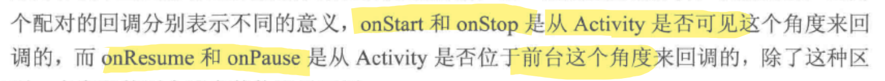
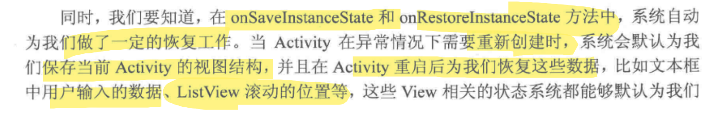
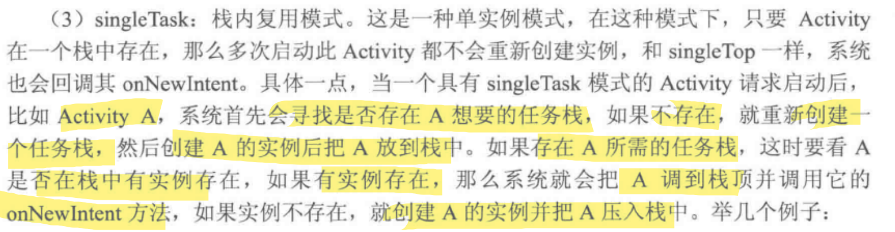
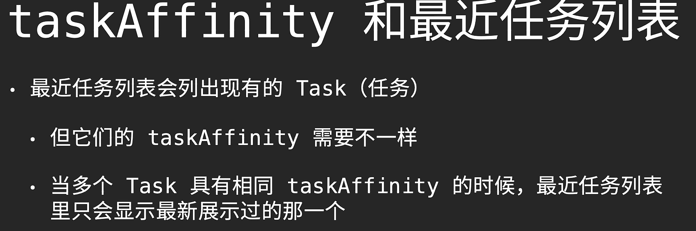
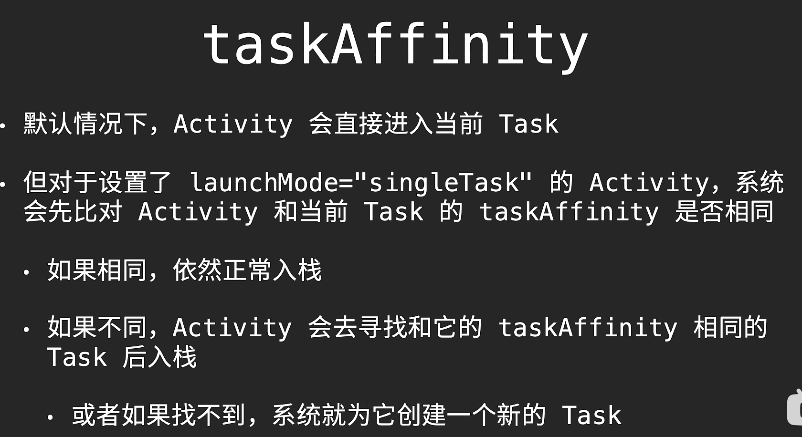

## Activity 

### activity 的创建

#### 编写布局xml文件

```xml
<?xml version="1.0" encoding="utf-8"?>
<androidx.constraintlayout.widget.ConstraintLayout xmlns:android="http://schemas.android.com/apk/res/android"
    xmlns:app="http://schemas.android.com/apk/res-auto"
    xmlns:tools="http://schemas.android.com/tools"
    android:layout_width="match_parent"
    android:layout_height="match_parent"
    tools:context=".MainActivity">
    <TextView
        android:id="@+id/main_text_view"
        android:layout_width="wrap_content"
        android:layout_height="wrap_content"
        android:layout_marginTop="144dp"
        android:text="Hello World!"
        app:layout_constraintTop_toTopOf="parent"
        tools:layout_editor_absoluteX="167dp" />

</androidx.constraintlayout.widget.ConstraintLayout>
```


#### 在代码中加载布局文件

```java
public class MainActivity extends AppCompatActivity {
  @Override
  protected void onCreate(Bundle savedInstanceState) {
    super.onCreate(savedInstanceState);
    // 设置activity的content view
    setContentView(R.layout.activity_main);
  }
}
```


#### 在 manifest里面注册并设置为主页面

下面的代码指定了app启动时打开的activity

`<action android:name="android.intent.action.MAIN" />`

`<category android:name="android.intent.category.LAUNCHER" />`

`android:label` 会变成launcher中应用程序显示的名称

比如下面的代码会使得手机桌面显示应用程序名字为label 

```xml
<?xml version="1.0" encoding="utf-8"?>
<manifest xmlns:android="http://schemas.android.com/apk/res/android"
    package="com.gzhu.kevin.viewpagertest">
    <application
        ... >
        <activity
            android:name=".MainActivity"
            android:label="label"      
            ... >
            <intent-filter>
                <action android:name="android.intent.action.MAIN" />
                <category android:name="android.intent.category.LAUNCHER" />
            </intent-filter>
        </activity>
    </application>

</manifest>
```


### activity的启动与销毁

#### 使用intent启动activity

`new Intent(Context packageContext, Class<?> cls)`中,cls代表要启动的目标活动的class

`startActivity(intent)`启动一个activity

#### acitvity的销毁

用户使用back键自动销毁

也可以调用Activity的`finish()`方法

### Activity 生命周期

- onCreate:创建页面 , 把页面上的各个元素加载到内存
- onStart:开始页面 , 把页面显示在屏幕上
- onResume:恢复页面 , 让页面在屏幕上活动起来 , 例如开启动画、开始任务等
- onPause:暂停页面 , 让页面在屏幕上的动作停下来
- onStop:停止页面 , 把页面从屏幕上撤下来
- onDestroy:销毁页面 , 把页面从内存中清除掉 
- onRestart:重启页面 , 重新加载内存中的页面数据



实际调用顺序

1. 打开页面调用


2. 页面跳转调用

   打开页面

   

   跳转页面

   

   返回页面

   

   

3. 竖屏与横屏的切换 

   打开时竖屏 -> 横屏 -> 竖屏

   

4. 进入页面后返回桌面再进入


### activity的状态保存

#### bundle对象 

> A mapping from String keys to various `Parcelable` values.

以键值对存储数据

其主要用来传递数据, 当传递对象或对象数组时, 对象必须实现[Serializable 或Parcelable](http://blog.csdn.net/mer1234567/article/details/7841657)接口( 此接口的方法可以将类序列化存放和反序列化取出)

在activity之间传递基本类型示例

```java
// "com.test" is the package name of the destination class
// "com.test.Activity02" is the full class path of the destination class
Intent intent = new Intent().setClassName("com.bundletest", "com.bundletest.Bundle02");

Bundle bundle = new Bundle();
bundle.putString("name", "skywang");
bundle.putInt("height", 175);
intent.putExtras(bundle);

startActivity(intent);

// end current class
finish();
```

```java
Bundle bundle = this.getIntent().getExtras();  
  
String name = bundle.getString("name");  
int height = bundle.getInt("height");
```

传递Parcelable类型的对象

> 通过 intent 发送数据时，应小心地将数据大小限制为几 KB。发送过多数据会导致系统抛出 `TransactionTooLargeException` 异常。

#### 状态保存

只有activity异常终止时才会调用onSaveInstanceState(Bundle outState) , 在此保存数据到bundle中

当activity被重新创建后, 系统调用onRestoreInstanceState(), 并将bundle对象传递给其和onCreate()



### task任务和backStack返回栈

安卓最近任务列表中放的就是一个个task

最近任务列表中不一定或者的task

task任务是用户在执行某项工作时与之互动的一系列 Activity 的集合

这些 Activity 按照每个 Activity 打开的顺序排列在一个返回堆栈中

默认情况 : 在不同的task中打开的activity, 新的activity的新实例就放在那个task中


### 启动模式


两种方式定义不同的启动模式：

1. 使用清单文件

​	使用 `<activity> `元素的 launchMode 属性

2. 使用 Intent 标记

​	调用 `startActivity()` 时，可以在 `Intent` 中添加一个标记, intent.setFlags()

> intent的优先级较高, 两者的包含的启动模式范围有所不同


#### standard

默认值。

系统在启动该 Activity 的任务中创建 Activity 的新实例，并将 intent 传送给该实例。

Activity 可以多次实例化，每个实例可以属于不同的任务，一个任务可以拥有多个实例。

#### singleTop

活动处于当前栈顶时不再创建,使用已有的activity,调用其 `onNewIntent()` 方法来将 intent 转送给该实例 

若不在栈顶, 则创建

#### singleTask



a如果在栈中有实例并且上面压入了别的activity

上面的会被清除掉

系统会把a所在的task压在当前task上

task的叠加只限于前台task, 进入后台就分开

> task由前台进入后台的情况
>
> 1. 用户按下home键
> 2. 按下最近任务键, 马上进入后台

#### singleInstance

启用一个新的返回栈管理此活动, 栈中只会有此一个activity,

这个新的task同样会压在原来的task上

由该 Activity 启动的任何 Activity 都会在其他的tas中打开，然后压过来


#### TaskAffinity

任务喜好

activity的taskAffinity没指明则为Application指明的taskAffinity

若application也没指明则为应用报名  

一个app只能有一个task显示在最近任务列表



对launchMode="singleTask"的活动生效



### allowTaskReparenting

> android9失效, android11后又好了
>
> ⚠ 最好不要用

打开时在打开的task上

稍后会回到原本所属的task上
