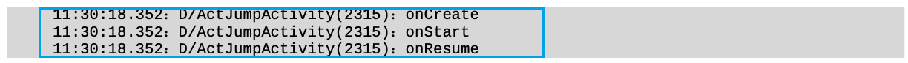
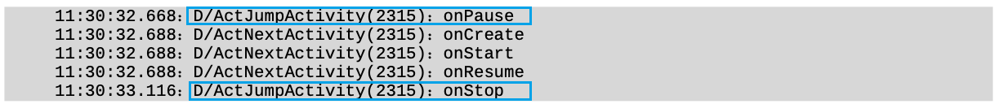

## Activity 

### activity 的创建

#### 编写布局xml文件

```xml
<?xml version="1.0" encoding="utf-8"?>
<androidx.constraintlayout.widget.ConstraintLayout xmlns:android="http://schemas.android.com/apk/res/android"
    xmlns:app="http://schemas.android.com/apk/res-auto"
    xmlns:tools="http://schemas.android.com/tools"
    android:layout_width="match_parent"
    android:layout_height="match_parent"
    tools:context=".MainActivity">
    <TextView
        android:id="@+id/main_text_view"
        android:layout_width="wrap_content"
        android:layout_height="wrap_content"
        android:layout_marginTop="144dp"
        android:text="Hello World!"
        app:layout_constraintTop_toTopOf="parent"
        tools:layout_editor_absoluteX="167dp" />

</androidx.constraintlayout.widget.ConstraintLayout>
```


#### 在代码中加载布局文件

```java
public class MainActivity extends AppCompatActivity {
  @Override
  protected void onCreate(Bundle savedInstanceState) {
    super.onCreate(savedInstanceState);
    // 设置activity的content view
    setContentView(R.layout.activity_main);
  }
}
```


#### 在 manifest里面注册并设置为主页面

下面的代码指定了app启动时打开的activity

`<action android:name="android.intent.action.MAIN" />`

`<category android:name="android.intent.category.LAUNCHER" />`

`android:label` 会变成launcher中应用程序显示的名称

比如下面的代码会使得手机桌面显示应用程序名字为label 

```xml
<?xml version="1.0" encoding="utf-8"?>
<manifest xmlns:android="http://schemas.android.com/apk/res/android"
    package="com.gzhu.kevin.viewpagertest">
    <application
        ... >
        <activity
            android:name=".MainActivity"
            android:label="label"      
            ... >
            <intent-filter>
                <action android:name="android.intent.action.MAIN" />
                <category android:name="android.intent.category.LAUNCHER" />
            </intent-filter>
        </activity>
    </application>

</manifest>
```


### activity的启动与销毁

#### 使用intent启动activity

`new Intent(Context packageContext, Class<?> cls)`中,cls代表要启动的目标活动的class

`startActivity(intent)`启动一个activity

#### acitvity的销毁

用户使用back键自动销毁

也可以调用Activity的`finish()`方法

### Activity 生命周期

- onCreate:创建页面 , 把页面上的各个元素加载到内存
- onStart:开始页面 , 把页面显示在屏幕上
- onResume:恢复页面 , 让页面在屏幕上活动起来 , 例如开启动画、开始任务等
- onPause:暂停页面 , 让页面在屏幕上的动作停下来
- onStop:停止页面 , 把页面从屏幕上撤下来
- onDestroy:销毁页面 , 把页面从内存中清除掉 
- onRestart:重启页面 , 重新加载内存中的页面数据

例子 (Sample)

1. 打开页面调用


2. 页面跳转调用

   - 打开页面

   

   - 跳转页面

   

   - 返回页面

   

   

3. 竖屏与横屏的切换

   打开时竖屏 -> 横屏 -> 竖屏

   

4. 进入页面后返回桌面再进入


### 返回栈

### 启动模式

standard

singleTop

活动处于栈顶时不再创建,使用已有的activity; 若不在栈顶, 则创建

singleTask

系统在返回栈中查找活动的实例, 若有, 在其之前的活动全部弹栈, 使用此实例

singleInstance

启用一个新的返回栈管理此活动

### 启动活动的最佳写法


### activity的状态保存

