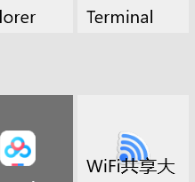

​		


# Android 开发笔记

[TOC]


## Android studio 工程目录

工程目录在左侧, 切换至 project 后有如下目录

- manifests
  - AndroidManifest.xml : app 内部运行配置

- java 
  - 有三个包, 一个是源码, 其他是测试用的
- res
  - drawable 
  - layout : app 页面布局
  - mipmap : 启动图标
  - values : 常量定义文件
    - strings.xml
    - dimens.xml
    - colors.xml
    - styles.xml
- Gradle Scripts
  - build.gradle  : app 工程编译规则 , 分为项目级和模块级
  - proguard-rules.pro 
  - gradle.properties 
  - settings.gradle
  - local.properties


## Android 显示基础

### 屏幕显示

#### android 描述大小的单位

- px 像素
- dp 和设备无关的显示单位, aka dip
- sp 用于设置字体大小

在 xml 布局文件中, 除文字外都使用 dp 来保证不同尺寸的手机显示相同的大小

在 java 代码中, 只能使用 px , 为保证大小统一, 可以使用 `Utils.dip2px()` 把 dp 变成相应的 px

#### 颜色

##### 颜色的表示

- 八位十六进制数 : FFEEDDCC , 从前往后每两位代表一个值, 不透明度, 红色浓度, 绿色, 蓝色
- 六位十六进制数 : 在 xml 中默认 FF (不透明) , java 代码中默认 00 (全透明)

##### 使用

- Color 中有定义好的 12 种颜色, 类型是 int
- 直接用十六进制的颜色编码赋值给 view
- 在 colors.xml 中定义后使用

### 视图 View 类

View 是所有控件和布局的祖先

### ViewGroup 类, 布局视图类

本质上是容器, 在其中可以放置其他 view 

所有的布局视图类都是它派生来的


## 常用 ui 控件 (View 子类)

### TextView

### button


java 代码中使用`button.setOnClickListener(new MyOnClickListener)`

传入一个实现了 `View.OnLongClickListener` 接口的类, 在该类实现的接口方法中编写按下的代码


### EidtText

### ImageView

只能显示图像

### ProgressBar

### Notification

### ToolBar

## 常用布局 layout

### relativeLayout 相对布局

view依靠父view和同级view之间的相对位置来布局

```xml
<RelativeLayout
    android:layout_width="match_parent"
    android:layout_height="match_parent">
    <Button
        android:id="@+id/button_main"
        android:layout_width="wrap_content"
        android:layout_height="wrap_content"
        
        android:layout_centerInParent="true"
        />

</RelativeLayout>
```


### linearLayout线性布局

常用属性

```
	// 布局方向
    android:orientation="vertical"
    // 布局宽度
    android:layout_width="match_parent"
    // 布局高度
    android:layout_height="match_parent"
	// 内部试图重力
	android:gravity="center"
```


### frameLayout

新添加的 view 会覆盖在之前的 view 上面

设置FrameLayout的前景图像可以使其固定在最上面

```xml
<FrameLayout
    android:layout_width="match_parent"
    android:layout_height="200dp"
    android:foregroundGravity="center"
    android:foreground=""
    >
    <Button
        android:layout_width="wrap_content"
        android:layout_height="wrap_content"
        />
</FrameLayout>
```


### tableLayout

### gridLayout

### constraintLayout

## Activity 

### activity 的创建

#### 编写布局xml文件

```xml
<?xml version="1.0" encoding="utf-8"?>
<androidx.constraintlayout.widget.ConstraintLayout xmlns:android="http://schemas.android.com/apk/res/android"
    xmlns:app="http://schemas.android.com/apk/res-auto"
    xmlns:tools="http://schemas.android.com/tools"
    android:layout_width="match_parent"
    android:layout_height="match_parent"
    tools:context=".MainActivity">
    <TextView
        android:id="@+id/main_text_view"
        android:layout_width="wrap_content"
        android:layout_height="wrap_content"
        android:layout_marginTop="144dp"
        android:text="Hello World!"
        app:layout_constraintTop_toTopOf="parent"
        tools:layout_editor_absoluteX="167dp" />

</androidx.constraintlayout.widget.ConstraintLayout>
```


#### 在代码中加载布局文件

```java

public class MainActivity extends AppCompatActivity {
  @Override
  protected void onCreate(Bundle savedInstanceState) {
    super.onCreate(savedInstanceState);
    // 设置activity的content view
    setContentView(R.layout.activity_main);
  }
}
```


#### 在 manifest里面注册并设置为主页面

下面的代码指定了app启动时打开的activity

`<action android:name="android.intent.action.MAIN" />`

`<category android:name="android.intent.category.LAUNCHER" />`

`android:label` 会变成launcher中应用程序显示的名称

比如下面的代码会使得手机桌面显示应用程序名字为label 

```xml
<?xml version="1.0" encoding="utf-8"?>
<manifest xmlns:android="http://schemas.android.com/apk/res/android"
    package="com.gzhu.kevin.viewpagertest">
    <application
        ... >
        <activity
            android:name=".MainActivity"
            android:label="label"      
            ... >
            <intent-filter>
                <action android:name="android.intent.action.MAIN" />
                <category android:name="android.intent.category.LAUNCHER" />
            </intent-filter>
        </activity>
    </application>

</manifest>
```

### acitvity的销毁

用户使用back键自动销毁

也可以调用Activity的`finish()`方法

### 使用intent调用activity

`new Intent(Context packageContext, Class<?> cls)`中,cls代表要启动的目标活动的class

`startActivity(intent)`启动一个activity


### Activity 生命周期

- onCreate:创建页面 , 把页面上的各个元素加载到内存
- onStart:开始页面 , 把页面显示在屏幕上
- onResume:恢复页面 , 让页面在屏幕上活动起来 , 例如开启动画、开始任务等
- onPause:暂停页面 , 让页面在屏幕上的动作停下来
- onStop:停止页面 , 把页面从屏幕上撤下来
- onDestroy:销毁页面 , 把页面从内存中清除掉 
- onRestart:重启页面 , 重新加载内存中的页面数据

例子 (Sample)

1. 打开页面调用


2. 页面跳转调用

   - 打开页面

   

   - 跳转页面

   

   - 返回页面

   

   

3. 竖屏与横屏的切换

   打开时竖屏 -> 横屏 -> 竖屏

   

4. 进入页面后返回桌面再进入


## todo : Intent

intent 中带有信息, 传递给被调用的组件

可以启动并传递信息给 activity, service, boardcastReceiver

### intent 类中字段

- Component name : 要启动的组件名称, 可以使用 `setComponent()`、`setClass()`、`setClassName()`，或 `Intent` 构造函数设置组件名称

- Action : 用于指定 intent 的操作行为, 只能指定一个

- Category : 指定 intent 的操作类别, 可以指定多个

- Data : 既 Uri , 和 action 配合使用 , 指定 action 要操作的数据**路径**

  

- Type ; 用于指定 Data 类型的定义

- 

- Extras

- Flags

### 显式 intent

 直接在构造函数中指定来源类和目标类

### 隐式 intent

不指定目标类, 根据动作让系统匹配拥有相同字符串定义的目标

使用隐式 Intent 时，Android 系统通过将 Intent 的内容与在设备上其他应用的[清单文件](https://developer.android.google.cn/guide/topics/manifest/manifest-intro)中声明的 **Intent 过滤器**进行比较，从而找到要启动的相应组件

如果 Intent 与 Intent 过滤器匹配，则系统将启动该组件，并向其传递 `Intent` 对象

如果多个 Intent 过滤器兼容，则系统会显示一个对话框，支持用户选取要使用的应用。


### Intent Filter 意图过滤器

 intent-filter 是在manifest中定义的 , 用于指定该组件要接收的 Intent 类型

例如 : AndroidManifest.xml 里activity 节点中就包含了 intent-filter

> 启动 `Service` 时，请始终使用显式 Intent
>
> 从 Android 5.0（API 级别 21）开始，如果使用隐式 Intent 调用 `bindService()`，系统会抛出异常
>
> 

### 向下一个 activity 传递参数

setData 只指定了


## 广播和广播接收器 broadcast && broadcast receiver 

广播发出和广播接收

### broadcast

通常使用接收器接收系统和自身的广播

> 有关系统广播操作的完整列表，请参阅 Android SDK 中的 `BROADCAST_ACTIONS.TXT` 文件
>
> 每个广播操作都有一个与之关联的常量字段。例如，常量 `ACTION_AIRPLANE_MODE_CHANGED` 的值为 `android.intent.action.AIRPLANE_MODE`
>
> 每个广播操作的文档都可以在关联的常量字段中找到。

广播发送很简单，如下

```java
// 发送 broadcast 刷新 appWidget
String action = new String(AppWidgetManager.ACTION_APPWIDGET_UPDATE);
Intent intent = new Intent(action);
intent.setClass(getApplicationContext(), MyAppWidgetProvider.class);
sendBroadcast(intent);
```

### broadcast receiver

广播接收器需要注册


有些广播的接收需要权限

#### 接收器注册

清单声明注册 : 如果应用尚未运行, 系统会在广播发出后启动您的应用来接收广播

上下文注册 : 只要注册上下文有效，上下文注册的接收器就会接收广播

> example
>
> 如果您在 `Activity` 上下文中注册，只要 Activity 没有被销毁，您就会收到广播
>
> 如果您在应用上下文中注册，只要应用在运行，您就会收到广播

##### 上下文注册

```java
{	// ......
  MyReceiver receiver;
  IntentFilter filter;
  // 创建一个广播接收器
  receiver = new MyReceiver();
  // 创建一个意图过滤器，只处理指定事件来源的广播
  filter = new IntentFilter(AppWidgetManager.ACTION_APPWIDGET_UPDATE);
  filter.addAction("com.kevin.custom");
  // 注册广播接收器，注册之后才能正常接收广播
  getApplicationContext().registerReceiver(receiver, filter);
	// ......
}
public class 
    MyReceiver extends BroadcastReceiver {
  @Override
  public void onReceive(Context context, Intent intent) {
    Log.d("Alarm", "my receive " + intent.getAction());
  }
}
```

##### 上下文注册之后的销毁

不再需要接收器或上下文不再有效时，必须注销接收器, 否则会有内存泄漏

> 如果使用 Activity 上下文在 `onCreate(Bundle)` 中注册接收器，则应在 `onDestroy()` 中注销,以防接收器从 Activity 上下文中泄露出去
>
> 如果您在 `onResume()` 中注册接收器，则应在 `onPause()` 中注销，以防多次注册接收器

```java
unregisterReceiver(receiver);      //注销动态广播接收器
```


##### 清单声明注册

`mainfest.xml` 的 application 节点中添加以下代码

```xml
<receiver android:name=".MyAppWidgetProvider">
  <!--sdfadsf-->
    <meta-data
        android:name="android.appwidget.provider"
        android:resource="@xml/appwidet_provider_info">

    </meta-data>

    <intent-filter>
        <action android:name="android.appwidget.action.APPWIDGET_UPDATE" />
        <action android:name="com.kevin.nihao" />
    </intent-filter>

</receiver>
```


### 注意

广播接收器不要重复new和注册, 也就是说最好使用单例模式

## Services 服务与thread 线程

 `Service` 是一种可在后台执行长时间运行操作而不提供界面的应用组件。

服务可由其他应用组件启动，而且即使用户切换到其他应用，服务仍将在后台继续运行

服务可分为前台和后台, 状态有启动和绑定两种

>  服务在其托管进程的主线程中运行，它既**不**创建自己的线程，也**不**在单独的进程中运行（除非另行指定） 

### 在子线程中更新UI

可以使用以下函数更新

- `Activity.runOnUiThread(Runnable)`

- `View.post(Runnable)`

- `View.postDelayed(Runnable, long)`

- `handler.post()`

- `handler.sendEmptyMessage()`

- 使用AsyncTask子类, 被弃用

  > **This class was deprecated in API level 30.**
  > Use the standard `java.util.concurrent` or [Kotlin concurrency utilities](https://developer.android.google.cn/topic/libraries/architecture/coroutines) instead.

这几种方式的原理都是通过handler消息机制来更新ui

#### handler 消息机制


每个线程各自的 looper 从各自的 messageQueue 中取出 message

一个 handler 和一个 looper 绑定, 可以通过 handler 发送 message 给 looper 所属的线程, 并且handler 的`run()`负责处理发送给本线程的 message

ui 主线程自带一个 looper, 其余线程必须自己创建并启动 looper

```java
// 一个Looper线程实现的典型例子
// 使用分离prepare()和loop()创建初始Handler与Looper进行通信 
class LooperThread extends Thread {
      public Handler mHandler;

      public void run() {
          Looper.prepare();

          mHandler = new Handler(Looper.myLooper()) {
              public void handleMessage(Message msg) {
                  // process incoming messages here
              }
          };

          Looper.loop();
      }
  }
```

### 服务概述

分为 启动服务 和 绑定服务

启动

服务可以同时为启动和绑定两种状态


### 启动服务

#### 创建

1. 创建 `Service` 的子类（或使用它的一个现有子类), 并override一些method, 在方法中实现逻辑

   ```java
   public class MyService extends Service {
     @Nullable
     @Override
     public IBinder onBind(Intent intent) {
       return null;
     }
     @Override
     public void onCreate() {
       super.onCreate();
     }
   
     @Override
     public int onStartCommand(Intent intent, int flags, int startId) {
       return super.onStartCommand(intent, flags, startId);
     }
   
     @Override
     public void onDestroy() {
       super.onDestroy();
     }
   
   
   }
   
   ```

   

2. 在manifest中注册,即添加 `<service>` 元素作为 `<application> `元素的子元素

   ```xml
   <manifest ... >
     ...
     <application ... >
         <service android:name=".ExampleService" />
         ...
     </application>
   </manifest>
   ```

#### 启动和停止

```java
    Intent startService = new Intent(this, MyService.class);
    startService(startService);

    Intent stopService = new Intent(this, MyService.class);
    startService(stopService);
```

### 绑定服务


### 服务的绑定状态

需要以下类

- Service子类
- IBinder 实现类
- ServiceConnection实现类

#### 服务绑定步骤

1. service子类必须实现`onBinder()`, 此函数返回一个IBinder实现类

2. 客户端调用 `bindService(intent, sericeConnection,flag)` , 传入ServiceConnection实现类

3. Android 系统创建客户端与服务之间的连接时，会对 `ServiceConnection` 调用 `onServiceConnected()`

   `onServiceConnected()` 方法包含一个 `IBinder` 参数，客户端需要保存此 IBinder 用于和服务通信

4. 只有在第一个客户端绑定服务时，系统才会调用服务的 `onBind()` 方法来生成 `IBinder`

5. 当最后一个客户端取消与服务的绑定时`unbindService(connection)`，系统会销毁该服务（除非还通过 `startService()` 启动了该服务）

> service的onBinder()返回的IBinder最终在serviceConnection的onServiceConnected()的传入参数获得

#### 服务绑定实践代码

service

activity

```

```


#### todo : IBinder实现类  

这部分以后再细看, 因为不需要跨进程, 现在先用扩展Binder类

- [扩展 Binder 类](https://developer.android.google.cn/guide/components/bound-services#Binder)

  如果服务是供您的自有应用专用，并且在与客户端相同的进程中运行（常见情况），您应当通过扩展 `Binder` 类并从 `onBind()` 返回该类的实例来创建接口。客户端收到 `Binder` 后，可利用它直接访问 `Binder` 实现或 `Service` 中提供的公共方法。

  如果服务只是您自有应用的后台工作器，应优先采用这种方式。您不使用这种方式创建接口的唯一一种情况是：其他应用或不同进程占用了您的服务。

- [使用 Messenger](https://developer.android.google.cn/guide/components/bound-services#Messenger)

  如需让接口跨不同进程工作，您可以使用 `Messenger` 为服务创建接口。采用这种方式时，服务会定义一个 `Handler`，用于响应不同类型的 `Message` 对象。此 `Handler` 是 `Messenger` 的基础，后者随后可与客户端分享一个 `IBinder`，以便客户端能利用 `Message` 对象向服务发送命令。此外，客户端还可定义一个自有 `Messenger`，以便服务回传消息。

  ​	这是执行进程间通信 (IPC) 最为简单的方式，因为 `Messenger` 会在单个线程中创建包含所有请求的队列，这样您就不必对服务进行线程安全设计。

- [使用 AIDL](https://developer.android.google.cn/guide/components/aidl)

  Android 接口定义语言 (AIDL) 会将对象分解成原语，操作系统可通过识别这些原语并将其编组到各进程中来执行 IPC。以前采用 `Messenger` 的方式实际上是以 AIDL 作为其底层结构。如上所述，`Messenger` 会在单个线程中创建包含所有客户端请求的队列，以便服务一次接收一个请求。不过，如果您想让服务同时处理多个请求，可以直接使用 AIDL。在此情况下，您的服务必须达到线程安全的要求，并且能够进行多线程处理。

  如需直接使用 AIDL，您必须创建用于定义编程接口的 `.aidl` 文件。Android SDK 工具会利用该文件生成实现接口和处理 IPC 的抽象类，您随后可在服务内对该类进行扩展。

#### 使用binder与service进行通信

例如在 IBinder中提供getService()获取当前服务实例, 然后在活动中通过服务实例来使用服务中的方法

也可以直接调用IBinder中的public方法

### 


### 前台服务

使用前台服务可以防止服务被回收, 会在通知栏显示一条类似通知的信息


### 服务的生命周期

#### 启动服务的周期

该服务在其他组件调用 `startService()` 时创建，然后无限期运行，且必须通过调用 `stopSelf()` 来自行停止运行。此外，其他组件也可通过调用 `stopService()` 来停止此服务。服务停止后，系统会将其销毁。

#### 绑定服务的周期

该服务在其他组件（客户端）调用 `bindService()` 时创建。然后，客户端通过 `IBinder` 接口与服务进行通信。客户端可通过调用 `unbindService()` 关闭连接。多个客户端可以绑定到相同服务，而且当所有绑定全部取消后，系统即会销毁该服务。（服务*不必*自行停止运行。）

#### 启动加绑定的服务的周期

即使所有客户端解绑, 还是要使用`stopService()`来停止服务


一个应用进程中一个service只有一个实例

`onCreate()`只会在第一次启动服务时调用

第一次启动服务时先调用`oncreate()`然后是`onStartCommand()`

多个服务启动请求会导致多次对服务的 `onStartCommand()` 进行相应的调用。

如要停止服务，只需一个服务停止请求（使用 `stopSelf()` 或 `stopService()`）即可, 此时服务中的`onDestroy()`会被执行


## Content provider


## Android 数据存储

数据可以存储在以下几个地方

- 应用专属存储空间：存储仅供应用使用的文件，可以存储到内部存储卷中的专属目录或外部存储空间中的其他专属目录。使用内部存储空间中的目录保存其他应用不应访问的敏感信息。(内部存储卷其他应用不可访问, 外部存储空间在 storage/emulated/0/Android/data/包名 )
- 共享存储：存储您的应用打算与其他应用共享的文件，包括媒体、文档和其他文件。
- 偏好设置：以键值对形式存储私有原始数据。
- 数据库：使用 Room 持久性库将结构化数据存储在专用数据库中。

### 使用SharedPreference保存键值对数据

SharedPreference 共享参数

一般用于保存偏好设置

保存文件路径 /data/data/应用包名/shared_prefs/文件名.xml

```java
// 从 SharePreferences xml 文件中获取共享参数对象
SharedPreferences shared = getSharedPreferences("share", MODE_PRIVATE);
// 获得 xml 文件编辑器对象
SharedPreferences.Editor editor = shared.edit();
// 使用编辑器存储数据
// 添加 String 键值（ DeveloperName对应 Kevin ）
editor.putString("DeveloperName","Kevin");
// 提交编辑器的修改
// editor.commit(); or editor.apply();
// 二者区别在于apply是异步写入, commit是同步写入,可能会导致ANR
editor.commit();
// 使用共享参数对象读取数据
String DeveloperName = shared.getString("DeveloperName","");
```

### SQLite 

#### SQLite 数据库

使用数据库流程

1. 创建或打开一个数据库 SQLiteDatabase
2. 操作数据库 : 增,查,删,改以及执行 SQL 语句
3. 关闭数据库 SQLiteDataBase

#### 使用 Room 操作 SQLite

如需在应用中使用 Room，请将以下依赖项添加到应用的 `build.gradle` 文件

```java
dependencies {
  def room_version = "2.2.6"

  implementation "androidx.room:room-runtime:$room_version"
  annotationProcessor "androidx.room:room-compiler:$room_version"

  // optional - RxJava support for Room
  implementation "androidx.room:room-rxjava2:$room_version"

  // optional - Guava support for Room, including Optional and ListenableFuture
  implementation "androidx.room:room-guava:$room_version"

  // optional - Test helpers
  testImplementation "androidx.room:room-testing:$room_version"
}
```

- Room 的三个组件
  - Database : 数据库holder,持有者
  - Data entities : 数据实体,要存储的类
  - Data access objects ( DAOs ) :数据库访问方法

- 三个组件之间的关系
  - 开发者使用 DAO的方法 将 Data entities的对象 放入 Database
  - 下面这个图为谷歌官方图(一坨 shit)
  - 


- 使用例子(Sample)

  1. 定义Data entity , Data access object 以及 Database 具体对象

     Data entity (更多使用细节 [使用 Room 实体定义数据 ](https://developer.android.com/training/data-storage/room/defining-data))

     ```java
     @Entity
     public class User {
         @PrimaryKey
         public int uid;
     
         @ColumnInfo(name = "first_name")
         public String firstName;
     
         @ColumnInfo(name = "last_name")
         public String lastName;
     }
     ```

     Data access object (更多使用细节 [使用 Room DAO 访问数据 ](https://developer.android.com/training/data-storage/room/accessing-data))

     ```java
     @Dao
     public interface UserDao {
         @Query("SELECT * FROM user")
         List<User> getAll();
     
         @Query("SELECT * FROM user WHERE uid IN (:userIds)")
         List<User> loadAllByIds(int[] userIds);
     
         @Query("SELECT * FROM user WHERE first_name LIKE :first AND " +
                "last_name LIKE :last LIMIT 1")
         User findByName(String first, String last);
     
         @Insert
         void insertAll(User... users);
     
         @Delete
         void delete(User user);
     }
     ```

     Database ( 更多使用细节见 )

     ```java
     @Database(entities = {User.class}, version = 1)
     public abstract class AppDatabase extends RoomDatabase {
         public abstract UserDao userDao();
     }
     ```

  2. 使用 Dao 操作数据库

     创建或者打开数据库

     ```java
     AppDatabase db = Room.databaseBuilder(getApplicationContext(),
             AppDatabase.class, "database-name").build();
     ```

     获取数据库访问方法

     ```java
     UserDao userDao = db.userDao(); // 获取 Dao 对象
     List<User> users = userDao.getAll(); // 获取数据库所有对象
     ```

     使用 Data access object 增,查,删,改

- Room entities 详细使用方法

  1. 主键(PrimaryKey)

  ```java
      @Entity
      public class User {
          @PrimaryKey
          public int id;
  
          public String firstName;
          public String lastName;
      }
      
  ```

  要存储类中的属性,必须将属性设为 public , 或者给出 getter 和 setter

  每个 entity 必须将一个属性定义为主键(PrimaryKey) , 且每一个实例对象必须有不同的主键值才可以放入数据库 , 就是说每个 entity 的对象都要有一个唯一的编号,不然不好找

  如果您想让 Room 为实体分配自动 ID，则可以设置 `@PrimaryKey` 的 [`autoGenerate`](https://developer.android.google.cn/reference/androidx/room/PrimaryKey#autoGenerate()) 属性。如果实体具有复合主键，您可以使用 [`@Entity`](https://developer.android.google.cn/reference/androidx/room/Entity) 注释的 [`primaryKeys`](https://developer.android.google.cn/reference/androidx/room/Entity#primaryKeys()) 属性，如以下代码段所示：

  ```java
     @Entity(primaryKeys = {"firstName", "lastName"})
      public class User {
          public String firstName;
          public String lastName;
      }
      
  ```

  2. 数据库表名称

  默认情况下，Room 将类名称用作数据库表名称。如果希望表具有不同的名称，请设置 [`@Entity`](https://developer.android.google.cn/reference/androidx/room/Entity) 注释的 [`tableName`](https://developer.android.google.cn/reference/androidx/room/Entity#tableName()) 属性，如以下代码段所示：

  ```java
      @Entity(tableName = "users")
      public class User {
          // ...
      }
      
  ```

  表名称不区分大小写

  3. 数据库列名称

  Room 将属性名称用作数据库中的列名称。如果希望列具有不同的名称，请将 [`@ColumnInfo`](https://developer.android.google.cn/reference/androidx/room/ColumnInfo) 注释添加到字段，如以下代码段所示：

  ```java
      @Entity(tableName = "users")
      public class User {
          @PrimaryKey
          public int id;
  
          @ColumnInfo(name = "first_name")
          public String firstName;
  
          @ColumnInfo(name = "last_name")
          public String lastName;
      }
      
  ```

  4. 忽略属性

  默认情况下，Room 会为实体中定义的每个属性创建一个列。如果<u>实体</u>(要存储的类)中有您不想保留的属性，则可以使用 [`@Ignore`](https://developer.android.google.cn/reference/androidx/room/Ignore) 为这些字段添加注释，如以下代码段所示：

  ```java
      @Entity
      public class User {
          @PrimaryKey
          public int id;
  
          public String firstName;
          public String lastName;
  
          @Ignore
          Bitmap picture;
      }   
  ```

  如果实体类继承了父类的属性，则使用 `@Entity` 属性的 [`ignoredColumns`](https://developer.android.google.cn/reference/androidx/room/Entity#ignoredcolumns) 属性来忽略：

  ```java
      @Entity(ignoredColumns = "picture")
      public class RemoteUser extends User {
          @PrimaryKey
          public int id;
  
          public boolean hasVpn;
      }
      
  ```

  5. 让表支持搜索功能,以后再学习(https://developer.android.google.cn/training/data-storage/room/defining-data#java)

- 使用 Dao 访问数据库

  1. 插入 insert

     ```java
     @Dao
     public interface UserDao {
     		@Insert(onConflict = OnConflictStrategy.REPLACE)
       	//OnConflictStrategy.ABORT（默认）在发生冲突时回滚事务
     		//OnConflictStrategy.REPLACE 现有行替换为新行
     		//OnConflictStrategy.IGNORE 持现有行  
       	public void insertUsers(User... users);
         @Insert
         public void insertBothUsers(User user1, User user2);
         @Insert
         public void insertUsersAndFriends(User user, List<User> friends);
     }
     ```

     如果 [`@Insert`](https://developer.android.google.cn/reference/androidx/room/Insert) 方法只接收 1 个参数，则它可以返回 `long`，这是插入项的新 `rowId`

     如果参数是数组或集合，则应返回 `long[]` 或 `List<Long>`

  2. 更新 Update

     ```java
     @Dao
     public interface UserDao {
         @Update
         public void updateUsers(User... users);
     }
     ```

     传入的对象的会替换在数据库中有相同 id 的那一行

     可以让此方法返回一个 `int` 值，以指示数据库中更新的行数

  3. 删除 delete

     ```java
         @Dao
         public interface MyDao {
             @Delete
             public void deleteUsers(User... users);
         }
         
     ```

     可以让此方法返回一个 `int` 值，以指示从数据库中删除的行数

  4. 查询 query

     - 简单查询

     - ```java
           @Dao
           public interface MyDao {
               @Query("SELECT * FROM user")
               public User[] loadAllUsers();
           }
           
       ```

- 总结一下

  - 现在还没有学过数据库,说一下我自己的理解

  - Room 可以把类的对象存储到数据库中

  - 每一个对象占一行(row),每一个对象中被存储的属性占一列

  - | 行 : 对象  列:属性 | 属性1               | 属性 2             | ...  |
    | ------------------ | ------------------- | ------------------ | ---- |
    | 对象 1(PrimaryKey) | 对象 1 的属性1 的值 | 对象 1 的属性2的值 |      |
    | 对象 2(PrimaryKey) | 对象 2 的属性1 的值 | 对象 2的属性2 的值 |      |
    | ...                |                     |                    |      |

  - 这样就组成一张表,一张表就是一个数据库

  - 要操作这个数据库就使用 Dao 中的方法


### 内部存储空间的访问（闪存）

```java
// File 对象可以代表文件和目录

// 获取应用在内部存储的文件目录
File dir = context.getFilesDir();

// 创建文件
File file = new File(context.getFilesDir().toString()+ "/ test.txt");
if(!file.exists()) {
  try {
    file.createNewFile();
  } catch (IOException e) {
    e.printStackTrace();
  }
}

```

## 自定义View

### android 的UI系统层级

```
Acitvity
	PhoneWindow
		DecorView
			TitleView
			ContentView
```


### view的绘制流程

#### measure() : 计算view的尺寸

`measure()`中通过调用view的`onMeasure()`来计算view的尺寸

可以重写`onMeasure()`来自定义测量过程

##### 文本尺寸的测量

##### 图形尺寸测量

##### 布局尺寸测量

#### layout() : 用来确定view在父容器中的布局位置

#### draw()


### view 的工作原理

xml

customView class


### 坐标系

#### Android 坐标系


#### View 坐标系


在视图坐标系中,原点是父视图的左上角


- 蓝色是 View 的方法
  - 还有 getHeight 和 getWidth 可以获取 view 自身的高度和宽度
- 绿色是 MotionEvent 的方法


## 动画

> 各动画的作用对象
>
> 帧动画 : 图片
>
> 补间动画 : view
>
> 属性动画 : view


### 补间动画 Tween Animation

> << Android 高级进阶 >> 有详细的 API 使用指南
>
> xml 和 java 中都可以使用

指定开始和结束,Android 自动生成中间帧

太简单,不可以做复杂的变换,而且真实位置没有改变

- 插值器 Interpolator (接口)
  - 控制动画的变化速度
  - Android 有实现好的类
  - 
  - 动画使用插值器 : `animation.setInterpolator(new AccelerateInterpolator());`

- AlphaAnimation 透明度动画
  - 
- RotateAnimation 旋转动画
  - 
- TranslateAnimation 位移动画
  - 
- ScaleAnimation 缩放动画
  - 
- AnimationSet 动画集合
  - 
- View 动画的监听
  - 

### 属性动画

#### ObjectAnimator

- 一个基本的平移动画

  - 
  - 参数
    - Object : 一个对象
    - String : 对象的属性名
    - float... : float 数组,属性变化的取值过程

- 属性动画常用属性值

  - translationX和translationY : 用来沿着X轴或者Y轴进行平移
  - rotation、rotationX、rotationY : 用来围绕View的支点进行
  - PrivotX和PrivotY : 控制View对象的支点位置，围绕这个支点进行旋转和缩放变换处理。默认该支点 位置就是View对象的中心
  - alpha : 透明度，默认是1(不透明)，0代表完全透明
  - x和y : 描述View对象在其容器中的最终位置

- 在使用ObjectAnimator的时候，要操作的属性必须要有get和set方法，不然 ObjectAnimator 就无法生效

  - 如果一个属性没有get、set方法，也可以通过自定义一个属性类或包装类来间 接地给这个属性增加get和set方法。现在来看看如何通过包装类的方法给一个属性增加get和set方法，代码如 下所示:

  - 

    

#### ValueAnimator

- ValueAnimator不提供任何动画效果，它更像一个数值发生器，用来产生有一定规律的数字，从而让调用者控制动画的实现过程。通常情况下，在ValueAnimator的AnimatorUpdateListener中监听数值的变化，然后使用这个值改变 view 的属性
- 

#### 动画事件的监听

- 完整的动画具有start、Repeat、End、Cancel这4个过程
- 
- 

#### AnimatorSet 动画集合

- 

- set.play()返回一个 Builder 对象

- Builder 类采用了建造者模式，每次调用方法时都返回 Builder 自身用于继续构建

- AnimatorSet.Builder中包括以下4个方法。AnimatorSet正是通过这几种方法来控制动画播放顺序的。

  -  after(Animator anim):将现有动画插入到传入的动画之后执行
  -  after(long delay):将现有动画延迟指定毫秒后执行。
  -  before(Animator anim):将现有动画插入到传入的动画之前
  -  with(Animator anim):将现有动画和传入的动画同时执行。

  

#### PropertyValuesHolder 组合动画

- 

#### 在XML中使用属性动画

- 

#### View 的 animate 方法

- 
- 


### 帧动画 Frame Animation

使用一组连续的图片,每张图片播放一定的时间,组合起来变成动画

- xml 方式实现


- java 实现

  

  

## 

## 触摸事件

### 触摸事件的处理

触摸屏从被按下 touch down -> move -> touch up 到手指离开是一个触摸事件序列 ( 触摸事件序列 : MotionEvent )

事件传递顺序 : Activity -> Window ->z 轴最下层的View -> 依次向上传递


```java
boolean dispatchTouchEvent() // 事件被分发给视图时调用

boolean onInterceptTouchEvent() // 事件分发给视图后调用,视图拦截事件,返回 true 则拦截,不会分发给下一层

boolean onTouchEvent() // 事件被拦截后调用,在其中处理触摸事件的响应,返回结果代表是否
```


- 视图被分发触摸事件 , dispatchTouchEvent 被调用
- 判断是否拦截此次事件
  - 拦截就调用 onTouchEvent 处理触摸事件 ,
    - onTouchEvent 返回 true,此次事件被消耗 
    - onTouchEvent 返回 false,此次事件传递给父视图的 onTouchEvent
  -  不拦截就调用 child.dispatchTouchEvent 获取此函数的返回值
  
- dispatchTouchEvent 返回 onTouchEvent 或 child.dispatchTouchEvent 的结果

  

### 触摸事件 MotionEvent 的内容

### View 的滑动

- layout() : View 的绘制方法,相当于重绘制
- offsetLeftAndRight() && offsetTopAndBottom()
- LayoutParams : 改变布局参数,设置 Margin
- 动画 : 属性动画可以改变 View 的位置
- scollTo 与 scollBy : 过程是瞬间完成的 , 移动的是View的内容 , 如果在ViewGroup中使用 , 则是移动其所有的子View,移动的参数应该为距离的负数,好像拿着手机拍摄报纸 , 报纸动 , 手机不动 , 想要下面的物体向上跑到中间 , 就要手机向下移动
- Scroller


## 高级控件

### ListView 

#### 继承抽象类 BaseAdapter

难理解的是

`@Override  public View getView(int position, View convertView, ViewGroup）` 

- positon：代表在列表中的位置
- converView：代表被给的 view
  - 如果这个为 null ，代表 ListView 里面没有回收的子视图，那就用这个创建一个子视图，赋值数据然后返回
  - 如果不为 null，代表ListView 里面有回收的子视图，赋值数据后返回

> 
>
> 
>
> 子视图第一次在 getView 中被创建的时候，给它写个标签，

```java
public class BatteryListAdapter extends BaseAdapter {

  Context context;
	ArrayList<MainActivity.BatteryChangedTimeInformation> list;

  public BatteryListAdapter(Context context, 			  	ArrayList<MainActivity.BatteryChangedTimeInformation> list){
    this.context = context;
    this.list = list;
  }

  @Override
  public int getCount() {
    return list.size();
  }

  @Override
  public Object getItem(int position) {
    return list.get(position);
  }

  @Override
  public long getItemId(int position) {
    return position;
  }

  @Override
  public View getView(int position, View convertView, ViewGroup parent) {
    ViewHolder viewHolder;
//ListView 使用 getView 来获取子视图，这个时候 convertView 为 null
    if(convertView == null){
      // 创建一个新的视图持有者
      viewHolder = new ViewHolder();
      // 创建一个子视图
      convertView = LayoutInflater.from(context).inflate(R.layout.adapter_child_view_layout, null);
      // 视图持有者获取视图
      viewHolder.textView = convertView.findViewById(R.id.textView);
      // 给子视图打上标签
      convertView.setTag(viewHolder);
    }
    // ListView 会回收不在屏幕中显示的子视图，converView 为回收的子视图
    else {
    // 此时就可以获取第一次创建视图时打的标签
      viewHolder = (ViewHolder)convertView.getTag();
    }

    // 利用视图持有者修改数据（其实子视图只有一个 TextView 的话，直接强制转换为 TextView，应该也是可以的，就可以不用 viewHolder 了）
    viewHolder.textViewString = list.get(position).currentTimeStr+"  "+list.get(position).batteryRemained+"%";
    viewHolder.textView.setText(viewHolder.textViewString);


    return convertView;
  }

  private class ViewHolder{
    TextView textView;
    String textViewString;
  }
}
```

 

#### 实现 ListView 代码

```java
ListView listView = findViewById(R.id.listview);
ArrayList<BatteryChangedTimeInformation> batteryList = new ArrayList<>();
// ......
// 为 batteryList 添加内容
// ......
ArrayAdapter<BatteryChangedTimeInformation> adapter = new ArrayAdapter<>(this,R.layout.adapter_child_view_layout, batteryList);
listView.setAdapter(adapter);
```

### RecyclerView


### Fragment

[`Fragment`](https://developer.android.com/reference/androidx/fragment/app/Fragment?hl=zh-cn) 表示应用界面中可重复使用的一部分。Fragment 定义和管理自己的布局，具有自己的生命周期，并且可以处理自己的输入事件。Fragment 不能独立存在，而是必须由 Activity 或另一个 Fragment 托管

#### fragment的创建

##### 设置依赖

在project的build.gradle中添加google maven 存储库

在module的build.gradle中添加以下依赖项

```groovy
dependencies {
    def fragment_version = "1.3.6"
    // Java language implementation
    implementation "androidx.fragment:fragment:$fragment_version"
    // Kotlin
    implementation "androidx.fragment:fragment-ktx:$fragment_version"
}
```

##### 创建 fragment 类

要创建自定义布局的fragment，请将fragment的布局资源提供给基本构造函数

```java
class ExampleFragment extends Fragment {
    public ExampleFragment() {
        super(R.layout.example_fragment);
    }
}
```

##### 把 fragment 添加到 activity

fragment必须嵌入到 AndroidX  FragmentActivity 才能提供ui显示, 而AppCompatActivity 是FragmentActivity的子类, 可以放入AppCompatActivity

#### 添加fragment

##### 通过 XML 添加

要以声明方式将片段添加到活动布局的 XML，请使用 `FragmentContainerView`元素。

```xml
<!-- res/layout/example_activity.xml -->
<androidx.fragment.app.FragmentContainerView
    xmlns:android="http://schemas.android.com/apk/res/android"
    android:id="@+id/fragment_container_view"
    android:layout_width="match_parent"
    android:layout_height="match_parent"
    android:name="com.example.ExampleFragment" />
```

##### 通过代码动态添加

如果通过代码动态添加就不要在xml中设置android:name属性

```
    if(savedInstanceState == null){
      getSupportFragmentManager().beginTransaction()
              .setReorderingAllowed(true)
              .add(R.id.main_my_fragment_code,MyFragment.class,null)
              .commit();
    }
```

#### google提供的方便使用的fragment的子类

Fragment 库提供了方便使用的基于fragment的类：

- [`DialogFragment`](https://developer.android.com/reference/androidx/fragment/app/DialogFragment)

  显示浮动对话框。使用此类创建对话框是在[`Activity`](https://developer.android.com/reference/android/app/Activity)类中使用对话框辅助方法的一个很好的替代方法 ，因为片段会自动处理`Dialog`. 有关 更多详细信息，请参阅[显示对话框`DialogFragment`](https://developer.android.com/guide/fragments/dialogs)。

- [`PreferenceFragmentCompat`](https://developer.android.com/reference/androidx/preference/PreferenceFragmentCompat)

  将[`Preference`](https://developer.android.com/reference/androidx/preference/Preference)对象层次结构显示 为列表。您可以使用`PreferenceFragmentCompat`来 [创建设置屏幕](https://developer.android.com/guide/topics/ui/settings)为您的应用程序。

#### fragment管理器

[`FragmentManager`](https://developer.android.com/reference/androidx/fragment/app/FragmentManager?hl=zh-cn) 类负责对应用的 Fragment 执行一些操作，如添加、移除或替换它们，以及将它们添加到返回堆栈

##### 访问fragmentManager

1. 在 Activity 中访问

   每个 [`FragmentActivity`](https://developer.android.com/reference/androidx/fragment/app/FragmentActivity?hl=zh-cn) 及其子类（如 [`AppCompatActivity`](https://developer.android.com/reference/androidx/appcompat/app/AppCompatActivity?hl=zh-cn)）都可以通过 [`getSupportFragmentManager()`](https://developer.android.com/reference/androidx/fragment/app/FragmentActivity?hl=zh-cn#getSupportFragmentManager()) 方法访问 `FragmentManager`。

2. 在 Fragment 中访问

   Fragment 也能够托管一个或多个子 Fragment。在 Fragment 内，您可以通过 [`getChildFragmentManager()`](https://developer.android.com/reference/androidx/fragment/app/Fragment?hl=zh-cn#getChildFragmentManager()) 获取对管理 Fragment 子级的 `FragmentManager` 的引用。如果您需要访问其宿主 `FragmentManager`，可以使用 [`getParentFragmentManager()`](https://developer.android.com/reference/androidx/fragment/app/Fragment?hl=zh-cn#getParentFragmentManager())。

#### 保存fragment的状态

由于fragment是由activity管理的, 每次activity变化时会影响到fragment, fragment经常重新创建


### ViewPager2

使用 ViewPager2 可以在fragment之间滑动

#### 添加AndroidX依赖项

```groovy
dependencies {
    implementation "androidx.viewpager2:viewpager2:1.0.0"
}
```

#### 创建fragemnt的布局xml文件

```xml
<?xml version="1.0" encoding="utf-8"?>
<androidx.constraintlayout.widget.ConstraintLayout xmlns:android="http://schemas.android.com/apk/res/android"
    android:layout_width="match_parent"
    android:layout_height="match_parent">
    <TextView
        android:id="@+id/fragment2_text_view"
        android:layout_width="match_parent"
        android:layout_height="match_parent"
        android:background="@drawable/view_pager_background_grey"
        android:text="text view"
        android:gravity="center"
        android:layout_marginRight="10dp"
        android:layout_marginLeft="10dp"
        />
</androidx.constraintlayout.widget
```

#### 创建fragment子类java文件

```java
public class MyFragmentForViewPager2 extends Fragment {
  public TextView textView;
  String tag;
  public MyFragmentForViewPager2(String tag) {
    super(R.layout.my_fragment_layout);
    this.tag = tag;
  }

  @Nullable
  @Override
  public View onCreateView(@NonNull LayoutInflater inflater, @Nullable ViewGroup container, @Nullable Bundle savedInstanceState) {
    View fragmentView = inflater.inflate(R.layout.my_fragment_for_view_pager2_layout, container, false);
    textView = fragmentView.findViewById(R.id.fragment2_text_view);
    textView.setText(tag);
    return fragmentView;
  }
}
```

#### 创建 FragmentStateAdapter 子类java文件

给ViewPager2使用

```java
public class MyViewPager2Adapter extends FragmentStateAdapter {
  List<Fragment> fragmentList = new ArrayList<>();

  public MyViewPager2Adapter(@NonNull FragmentActivity fragmentActivity) {
    super(fragmentActivity);
    for (int i = 0; i < 3; i++) {
      fragmentList.add(new MyFragmentForViewPager2(String.valueOf(i)));
    }
  }

  @NonNull
  @Override
  public Fragment createFragment(int position) {
    return fragmentList.get(position);
  }

  @Override
  public int getItemCount() {
    return fragmentList.size();
  }
}

```

#### 在activity_main.xml布局中添加ViewPager2布局文件

```xml
    <androidx.viewpager2.widget.ViewPager2
        android:id="@+id/main_view_pager2"
        android:layout_width="match_parent"
        android:layout_height="180dp"
        android:layout_marginTop="10dp"
        app:layout_constraintTop_toBottomOf="@+id/main_view_pager"

        />
```


#### 在Acitivty中设置ViewPager2的适配器

这里写在一个method中

```java
  private void initViewPager2(){
    MyViewPager2Adapter myViewPager2Adapter = new MyViewPager2Adapter(this);
    ViewPager2 viewPager2 = findViewById(R.id.main_view_pager2);
    viewPager2.setAdapter(myViewPager2Adapter);
  }
```

#### todo : 自定义ViewPager2切换fragment时的动画

等学了动画再回来细看


## fragment


## 网络通信


## todo : 通知

### 添加依赖库

```groovy
dependencies {
        implementation "com.android.support:support-compat:28.0.0"
    }
    
```

### 创建通知渠道 

android 8.0 以上需要先创建通知渠道, 然后构建通知, 通过通知管理器推送

```java
    private void createNotificationChannel() {
        // Create the NotificationChannel, but only on API 26+ because
        // the NotificationChannel class is new and not in the support library
        if (Build.VERSION.SDK_INT >= Build.VERSION_CODES.O) {
            CharSequence name = getString(R.string.channel_name);
            String description = getString(R.string.channel_description);
            int importance = NotificationManager.IMPORTANCE_DEFAULT;
            NotificationChannel channel = new NotificationChannel(CHANNEL_ID, name, importance);
            channel.setDescription(description);
            
            // Register the channel with the system; you can't change the importance
            // or other notification behaviors after this
            NotificationManager notificationManager = getSystemService(NotificationManager.class);
            notificationManager.createNotificationChannel(channel);
        }
    }
    
```

### 构建通知 NotificationCompat.Builder

builder可以设置通知的各个部分, 不过我在使用setSound(null)时, 通知还是会有声音, 只能在创建渠道时设置无声`channel.setSound(null,null);`

看查看set代码对应通知的哪个部分，请参阅[通知剖析](https://developer.android.com/guide/topics/ui/notifiers/notifications?hl=zh-cn#Templates)。

```java
    NotificationCompat.Builder builder = new NotificationCompat.Builder(this, CHANNEL_ID)
            .setSmallIcon(R.drawable.notification_icon)
            .setContentTitle("My notification")
            .setContentText("Much longer text that cannot fit one line...")
            .setStyle(new NotificationCompat.BigTextStyle()
                    .bigText("Much longer text that cannot fit one line..."))
            .setPriority(NotificationCompat.PRIORITY_DEFAULT);
    
```


### 设置通知的点按操作


```java
    // Create an explicit intent for an Activity in your app
    Intent intent = new Intent(this, AlertDetails.class);
    intent.setFlags(Intent.FLAG_ACTIVITY_NEW_TASK | Intent.FLAG_ACTIVITY_CLEAR_TASK);
    PendingIntent pendingIntent = PendingIntent.getActivity(this, 0, intent, 0);

    NotificationCompat.Builder builder = new NotificationCompat.Builder(this, CHANNEL_ID)
            .setSmallIcon(R.drawable.notification_icon)
            .setContentTitle("My notification")
            .setContentText("Hello World!")
            .setPriority(NotificationCompat.PRIORITY_DEFAULT)
            // Set the intent that will fire when the user taps the notification
            .setContentIntent(pendingIntent)
            .setAutoCancel(true);
    
```

请注意，此代码会调用 `setAutoCancel()`，它会在用户点按通知后自动[移除通知](https://developer.android.com/training/notify-user/build-notification?hl=zh-cn#Removing)。

### 显示通知

```java
  NotificationManagerCompat notificationManager = NotificationManagerCompat.from(this);

    // notificationId is a unique int for each notification that you must define
    notificationManager.notify(notificationId, builder.build());
    
```

请记得保存您传递到 `NotificationManagerCompat.notify()` 的通知 ID，因为如果之后您想要[更新](https://developer.android.com/training/notify-user/build-notification?hl=zh-cn#Updating)或[移除通知](https://developer.android.com/training/notify-user/build-notification?hl=zh-cn#Removing)，将需要使用这个 ID

## 权限

app 要获取受限数据或者受限操作, 必须请求权限

[权限 API 参考文档页面](https://developer.android.com/reference/android/Manifest.permission?hl=zh-cn) 包含了所有的权限


### 权限类型

Android 将权限分为不同的类型，包括安装时权限、运行时权限和特殊权限。每种权限类型都指明了当系统授予应用该权限后，应用可以访问的受限数据范围以及应用可以执行的受限操作范围。

#### 安装时权限

系统会在用户安装您的应用时自动授予应用相应权限

> 这里有个坑, 安装时权限的请求并不是所有的都会在安装自动授予, 具体要看[权限 API 参考文档页面](https://developer.android.com/reference/android/Manifest.permission?hl=zh-cn)

1. 普通权限

   此类权限允许访问超出应用沙盒的数据和执行超出应用沙盒的操作。但是，这些数据和操作对用户隐私及对其他应用的操作带来的风险非常小。

   系统会为普通权限分配“normal”保护级别

2. 签名权限

   当应用声明了其他应用已定义的签名权限时，如果两个应用使用同一证书进行签名，系统会在安装时向前者授予该权限。否则，系统无法向前者授予该权限。

   **注意**：有些签名权限不适合第三方应用使用	

   系统会为签名权限分配“signature”保护级别

#### 运行时权限

也称为危险权限，此类权限授予应用对受限数据的额外访问权限，并允许应用执行对系统和其他应用具有更严重影响的受限操作。需要先在应用中[请求运行时权限](https://developer.android.com/training/permissions/requesting?hl=zh-cn)，然后才能访问受限数据或执行受限操作

系统会为运行时权限分配“dangerous”保护级别

#### 特殊权限

特殊权限与特定的应用操作相对应。只有平台和原始设备制造商 (OEM) 可以定义特殊权限。此外，如果平台和 OEM 想要防止有人执行功能特别强大的操作（例如通过其他应用绘图），通常会定义特殊权限。

系统设置中的**特殊应用访问权限**页面包含一组用户可切换的操作。其中的许多操作都以特殊权限的形式实现。

每项特殊权限都有自己的实现细节。如需查看使用每项特殊权限的说明，请访问[权限 API 参考文档页面](https://developer.android.com/reference/android/Manifest.permission?hl=zh-cn)。系统会为特殊权限分配“appop”保护级别。

### 请求权限的流程

> android 6.0 之前所有的权限只要在manifest 中声明即可

执行权限请求的过程取决于权限类型：

- 如果是[安装时权限](https://developer.android.com/guide/topics/permissions/overview?hl=zh-cn#install-time)（例如普通权限或签名权限），向manifest添加声明, 系统会在安装您的应用时自动为其授予相应权限

  > 有少部分安装时权限系统不会自动授予 , 比如说 ACTION_REQUEST_IGNORE_BATTERY_OPTIMIZATIONS , 具体要看[权限 API 参考文档页面](https://developer.android.com/reference/android/Manifest.permission?hl=zh-cn) 

- 如果是[运行时权限](https://developer.android.com/guide/topics/permissions/overview?hl=zh-cn#runtime)，并且您的应用安装在搭载 Android 6.0（API 级别 23）或更高版本的设备上，则您必须自己在代码中动态[请求权限](https://developer.android.com/training/permissions/requesting?hl=zh-cn)。

#### 安装时权限请求

向manifest添加声明以请求

如需声明应用可能请求的权限，请在应用的清单文件中添加相应的 [``](https://developer.android.com/guide/topics/manifest/uses-permission-element?hl=zh-cn) 元素。例如，需要访问相机的应用应在AndroidManifest.xml 中添加以下代码行：

```xml
<manifest ...>
    <uses-permission android:name="android.permission.CAMERA"/>
    <application ...>
        ...
    </application>
</manifest>
```

#### 运行时权限请求

1. 在应用 manifest 中，[声明应用可能需要请求的权限](https://developer.android.com/training/permissions/declaring?hl=zh-cn)

   > 如果没有声明, requestPermissionLauncher.launch()并不会弹出系统的权限请求对话框
   >
   > 并且直接在ActivityResultCallback的方法onActivityResult() 中传入false
   >
   > 也就是说系统直接会直接拒绝权限

2. 通知系统请求权限  `requestPermissionLauncher.launch(PermissonNameString);`

   系统会弹出窗口给用户以请求权限, 代码中的 isGranted 代表用户是否允许权限, if 判断用来给开发者进行权限申请被允许或拒绝以后的操作

   ```java
    public ActivityResultLauncher<String> requestPermissionLauncher = registerForActivityResult(new ActivityResultContracts.RequestPermission(), new ActivityResultCallback<Boolean>() {
       @Override
       public void onActivityResult(Boolean isGranted) {
         if (isGranted) {
           // Permission is granted. Continue the action or workflow in your
           // app.
           Log.d("myLog", "permission is granted");
   
         } else {
           Log.d("myLog", "user refuse,permission is not granted");
           // Explain to the user that the feature is unavailable because the
           // features requires a permission that the user has denied. At the
           // same time, respect the user's decision. Don't link to system
           // settings in an effort to convince the user to change their
           // decision.
   
         }
       }
     });
   ```

3. 更优雅的请求是先向用户弹出窗口说app需要使用这个权限来做什么事请, 用户点击确认后再启动系统请求

   ```java
     private void requestMyPermission(MyCameraRequestDialogFragment myCameraRequestDialogFragment) {
       Log.d("myLog", "request permission");
       int isPermitted = ActivityCompat.checkSelfPermission(this, Manifest.permission.CAMERA);
       if (isPermitted == PackageManager.PERMISSION_GRANTED) {
         Log.d("myLog", "have permission, don't request");
       } else if (ActivityCompat.shouldShowRequestPermissionRationale(this, Manifest.permission.CAMERA)) {
         Log.d("myLog", "should Show Request Permission Rationale");
         myCameraRequestDialogFragment.show(getSupportFragmentManager(), "请求调用相机");
       } else {
         Log.d("myLog", "don't need to show rationale, directly request permission");
         requestPermissionLauncher.launch(Manifest.permission.CAMERA);
       }
     }
   ```

#### 一小部分特殊的安装时权限请求

```java
/**
 * 忽略电池优化
 */
public void ignoreBatteryOptimization(Activity activity) {
 
    PowerManager powerManager = (PowerManager) getSystemService(POWER_SERVICE);
 
    boolean hasIgnored = powerManager.isIgnoringBatteryOptimizations(activity.getPackageName());
    //  判断当前APP是否有加入电池优化的白名单，如果没有，弹出加入电池优化的白名单的设置对话框。
    if(!hasIgnored) {
          Intent intent = new Intent(Settings.ACTION_REQUEST_IGNORE_BATTERY_OPTIMIZATIONS);
        intent.setData(Uri.parse("package:"+activity.getPackageName()));
        startActivity(intent);
    }
}

```


## android 架构组件

Android 架构组件是一组库，可帮助您设计稳健、可测试且易维护的应用

### viewbinding

模块中启用视图绑定重新编译之后，系统会为该模块中的每个 XML 布局文件生成一个绑定类

绑定类的实例包含对在相应布局中具有 ID 的所有视图的直接引用

生成类的目录在 *模块根目录/build/generated/data_binding_base_class_source_out*下

视图绑定功能可按模块启用。要在某个模块中启用视图绑定，请将 `viewBinding` 元素添加到其 `build.gradle` 文件中，如下例所示：

```groovy
android {
        ...
        viewBinding {
            enabled = true
        }
    }
    
```

如果您希望在生成绑定类时忽略某个布局文件，请将 `tools:viewBindingIgnore="true"` 属性添加到相应布局文件的根视图中：

```xml
<LinearLayout
            ...
            tools:viewBindingIgnore="true" >
        ...
    </LinearLayout>
    
```

#### 在 Activity 中使用视图绑定

如需设置绑定类的实例以供 Activity 使用，请在 Activity 的 [`onCreate()`](https://developer.android.google.cn/reference/kotlin/android/app/Activity#oncreate) 方法中执行以下步骤：

1. 调用生成的绑定类中包含的静态 `inflate()` 方法。此操作会创建该绑定类的实例以供 Activity 使用。
2. 通过调用 `getRoot()` 方法或使用 [Kotlin 属性语法](https://kotlinlang.org/docs/reference/properties.html#declaring-properties)获取对根视图的引用。
3. 将根视图传递到 [`setContentView()`](https://developer.android.google.cn/reference/kotlin/android/app/Activity#setcontentview_1)，使其成为屏幕上的活动视图。

```java
    private ResultProfileBinding binding;

    @Override
    protected void onCreate(Bundle savedInstanceState) {
        super.onCreate(savedInstanceState);
        binding = ResultProfileBinding.inflate(getLayoutInflater());
        View view = binding.getRoot();
        setContentView(view);
    }
    
```

您现在即可使用该绑定类的实例来引用任何视图：

```java
    binding.getName().setText(viewModel.getName());
    binding.button.setOnClickListener(new View.OnClickListener() {
        viewModel.userClicked()
    });
    
```

