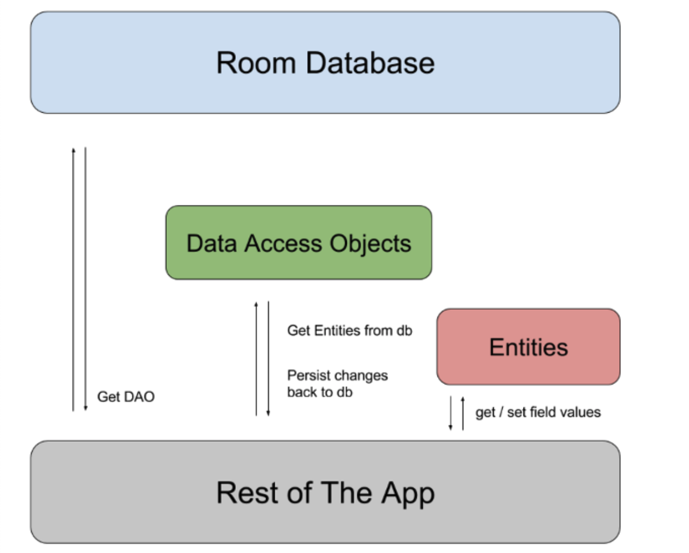

## Android 数据存储

数据可以存储在以下几个地方

- 应用专属存储空间：存储仅供应用使用的文件，可以存储到内部存储卷中的专属目录或外部存储空间中的其他专属目录。使用内部存储空间中的目录保存其他应用不应访问的敏感信息。(内部存储卷其他应用不可访问, 外部存储空间在 storage/emulated/0/Android/data/包名 )
- 共享存储：存储您的应用打算与其他应用共享的文件，包括媒体、文档和其他文件。
- 偏好设置：以键值对形式存储私有原始数据。
- 数据库：使用 Room 持久性库将结构化数据存储在专用数据库中。

### 使用SharedPreference保存键值对数据

SharedPreference 共享参数

一般用于保存偏好设置

保存文件路径 /data/data/应用包名/shared_prefs/文件名.xml

```java
// 从 SharePreferences xml 文件中获取共享参数对象
SharedPreferences shared = getSharedPreferences("share", MODE_PRIVATE);
// 获得 xml 文件编辑器对象
SharedPreferences.Editor editor = shared.edit();
// 使用编辑器存储数据
// 添加 String 键值（ DeveloperName对应 Kevin ）
editor.putString("DeveloperName","Kevin");
// 提交编辑器的修改
// editor.commit(); or editor.apply();
// 二者区别在于apply是异步写入, commit是同步写入,可能会导致ANR
editor.commit();
// 使用共享参数对象读取数据
String DeveloperName = shared.getString("DeveloperName","");
```

### SQLite 

#### SQLite 数据库

使用数据库流程

1. 创建或打开一个数据库 SQLiteDatabase
2. 操作数据库 : 增,查,删,改以及执行 SQL 语句
3. 关闭数据库 SQLiteDataBase

#### 使用 Room 操作 SQLite

如需在应用中使用 Room，请将以下依赖项添加到应用的 `build.gradle` 文件

```java
dependencies {
  def room_version = "2.2.6"

  implementation "androidx.room:room-runtime:$room_version"
  annotationProcessor "androidx.room:room-compiler:$room_version"

  // optional - RxJava support for Room
  implementation "androidx.room:room-rxjava2:$room_version"

  // optional - Guava support for Room, including Optional and ListenableFuture
  implementation "androidx.room:room-guava:$room_version"

  // optional - Test helpers
  testImplementation "androidx.room:room-testing:$room_version"
}
```

- Room 的三个组件
  - Database : 数据库holder,持有者
  - Data entities : 数据实体,要存储的类
  - Data access objects ( DAOs ) :数据库访问方法

- 三个组件之间的关系
  - 开发者使用 DAO的方法 将 Data entities的对象 放入 Database
  - 下面这个图为谷歌官方图
  - 


- 使用例子(Sample)

  1. 定义Data entity , Data access object 以及 Database 具体对象

     Data entity (更多使用细节 [使用 Room 实体定义数据 ](https://developer.android.com/training/data-storage/room/defining-data))

     ```java
     @Entity
     public class User {
         @PrimaryKey
         public int uid;
     
         @ColumnInfo(name = "first_name")
         public String firstName;
     
         @ColumnInfo(name = "last_name")
         public String lastName;
     }
     ```

     Data access object (更多使用细节 [使用 Room DAO 访问数据 ](https://developer.android.com/training/data-storage/room/accessing-data))

     ```java
     @Dao
     public interface UserDao {
         @Query("SELECT * FROM user")
         List<User> getAll();
     
         @Query("SELECT * FROM user WHERE uid IN (:userIds)")
         List<User> loadAllByIds(int[] userIds);
     
         @Query("SELECT * FROM user WHERE first_name LIKE :first AND " +
                "last_name LIKE :last LIMIT 1")
         User findByName(String first, String last);
     
         @Insert
         void insertAll(User... users);
     
         @Delete
         void delete(User user);
     }
     ```

     Database ( 更多使用细节见google官方文档 )

     ```java
     @Database(entities = {User.class}, version = 1)
     public abstract class AppDatabase extends RoomDatabase {
         public abstract UserDao userDao();
     }
     ```

  2. 使用 Dao 操作数据库

     创建或者打开数据库

     ```java
     AppDatabase db = Room.databaseBuilder(getApplicationContext(),
             AppDatabase.class, "database-name").build();
     ```

     获取数据库访问方法

     ```java
     UserDao userDao = db.userDao(); // 获取 Dao 对象
     List<User> users = userDao.getAll(); // 获取数据库所有对象
     ```

     使用 Data access object 增,查,删,改

##### Room entities 详细使用方法

1. 主键(Primary Key)

```java
    @Entity
    public class User {
        @PrimaryKey
        public int id;

        public String firstName;
        public String lastName;
    }
    
```

要存储类中的属性,必须将属性设为 public , 或者给出 getter 和 setter

每个 entity 必须将一个属性定义为主键(Primary Key) , 且每一个实例对象必须有不同的主键值才可以放入数据库 , 就是说每个 entity 的对象都要有一个唯一的编号,不然不好找

如果您想让 Room 为实体分配自动 ID，则可以设置 `@PrimaryKey` 的 [`autoGenerate`](https://developer.android.google.cn/reference/androidx/room/PrimaryKey#autoGenerate()) 属性。如果实体具有复合主键，您可以使用 [`@Entity`](https://developer.android.google.cn/reference/androidx/room/Entity) 注释的 [`primaryKeys`](https://developer.android.google.cn/reference/androidx/room/Entity#primaryKeys()) 属性，如以下代码段所示：

```java
   @Entity(primaryKeys = {"firstName", "lastName"})
    public class User {
        public String firstName;
        public String lastName;
    }
    
```

2. 数据库表名称

默认情况下，Room 将类名称用作数据库表名称。如果希望表具有不同的名称，请设置 [`@Entity`](https://developer.android.google.cn/reference/androidx/room/Entity) 注释的 [`tableName`](https://developer.android.google.cn/reference/androidx/room/Entity#tableName()) 属性，如以下代码段所示：

```java
    @Entity(tableName = "users")
    public class User {
        // ...
    }
    
```

表名称不区分大小写

3. 数据库列名称

Room 将属性名称用作数据库中的列名称。如果希望列具有不同的名称，请将 [`@ColumnInfo`](https://developer.android.google.cn/reference/androidx/room/ColumnInfo) 注释添加到字段，如以下代码段所示：

```java
    @Entity(tableName = "users")
    public class User {
        @PrimaryKey
        public int id;

        @ColumnInfo(name = "first_name")
        public String firstName;

        @ColumnInfo(name = "last_name")
        public String lastName;
    }
    
```

4. 忽略属性

默认情况下，Room 会为实体中定义的每个属性创建一个列。如果<u>实体</u>(要存储的类)中有您不想保留的属性，则可以使用 [`@Ignore`](https://developer.android.google.cn/reference/androidx/room/Ignore) 为这些字段添加注释，如以下代码段所示：

```java
    @Entity
    public class User {
        @PrimaryKey
        public int id;

        public String firstName;
        public String lastName;

        @Ignore
        Bitmap picture;
    }   
```

如果实体类继承了父类的属性，则使用 `@Entity` 属性的 [`ignoredColumns`](https://developer.android.google.cn/reference/androidx/room/Entity#ignoredcolumns) 属性来忽略：

```java
    @Entity(ignoredColumns = "picture")
    public class RemoteUser extends User {
        @PrimaryKey
        public int id;

        public boolean hasVpn;
    }
    
```

5. 让表支持搜索功能,以后再学习(https://developer.android.google.cn/training/data-storage/room/defining-data#java)

##### 使用 Dao 访问数据库

1. 插入 insert

   ```java
   @Dao
   public interface UserDao {
   		@Insert(onConflict = OnConflictStrategy.REPLACE)
     	//OnConflictStrategy.ABORT（默认）在发生冲突时回滚事务
   		//OnConflictStrategy.REPLACE 现有行替换为新行
   		//OnConflictStrategy.IGNORE 持现有行  
     	public void insertUsers(User... users);
       @Insert
       public void insertBothUsers(User user1, User user2);
       @Insert
       public void insertUsersAndFriends(User user, List<User> friends);
   }
   ```

   如果 [`@Insert`](https://developer.android.google.cn/reference/androidx/room/Insert) 方法只接收 1 个参数，则它可以返回 `long`，这是插入项的新 `rowId`

   如果参数是数组或集合，则应返回 `long[]` 或 `List<Long>`

2. 更新 Update

   ```java
   @Dao
   public interface UserDao {
       @Update
       public void updateUsers(User... users);
   }
   ```

   传入的对象的会替换在数据库中有相同 id 的那一行

   可以让此方法返回一个 `int` 值，以指示数据库中更新的行数

3. 删除 delete

   ```java
       @Dao
       public interface MyDao {
           @Delete
           public void deleteUsers(User... users);
       }
       
   ```

   可以让此方法返回一个 `int` 值，以指示从数据库中删除的行数

4. 查询 query

   - 简单查询

   - ```java
         @Dao
         public interface MyDao {
             @Query("SELECT * FROM user")
             public User[] loadAllUsers();
         }
         
     ```
   
5. 总结一下

  - 现在还没有学过数据库,说一下我自己的理解

  - Room 可以把类的对象存储到数据库中

  - 每一个对象占一行(row),每一个对象中被存储的属性占一列

  - | 行 : 对象  列:属性 | 属性1               | 属性 2             | ...  |
    | ------------------ | ------------------- | ------------------ | ---- |
    | 对象 1(PrimaryKey) | 对象 1 的属性1 的值 | 对象 1 的属性2的值 |      |
    | 对象 2(PrimaryKey) | 对象 2 的属性1 的值 | 对象 2的属性2 的值 |      |
    | ...                |                     |                    |      |

  - 这样就组成一张表,一张表就是一个数据库

  - 要操作这个数据库就使用 Dao 中的方法


### 内部存储空间的访问（闪存）

- **应用专属存储空间**：

  存储仅供应用使用的文件，

  可以存储到**内部**存储卷中的专属目录或**外部**存储空间中的其他专属目录。

  使用内部存储空间中的目录保存其他应用不应访问的敏感信息。

  从内部存储空间访问，可以使用 `getFilesDir()` 或 `getCacheDir()` 方法

  从外部存储空间访问，可以使用 `getExternalFilesDir()` 或 `getExternalCacheDir()` 方法

- **共享存储**：存储您的应用打算与其他应用共享的文件，包括媒体、文档和其他文件。


```java
// File 对象可以代表文件和目录

// 获取应用在内部存储的文件目录
File dir = context.getFilesDir();

// 创建文件
File file = new File(context.getFilesDir().toString()+ "/ test.txt");
if(!file.exists()) {
  try {
    file.createNewFile();
  } catch (IOException e) {
    e.printStackTrace();
  }
}

```

## 

### Content provider

ContentProvider主要用于在不同的应用程序之间实现数据共享的功能

它提供了一套完整的机制，允许一个程序访问另一个程序中的数据，同时还能保证被访问数据的安全性

目前使用ContentProvider是Android实现跨程序共享数据的标准方式

