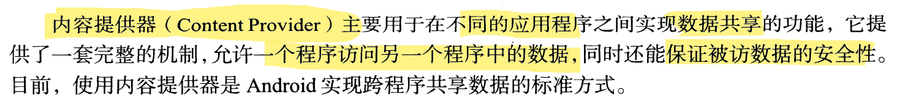

## content provider

将数据共享给其他app



> 来自 << 第一行代码>>


### URI

URI（Universal Resource Identifier）统一资源标识符

> URL是uri的子集, 用定位的方式标识出唯一一个资源

URI 为系统中的每一个资源赋予一个名字

URI 的格式如下：

```
// 规则
[scheme:][//host:port][path][?query]
// 示例
content://com.wang.provider.myprovider/tablename/id：
```


### MIME

con媒体类型（通常称为 Multipurpose Internet Mail Extensions 或 MIME 类型 ）是一种标准，用来**表示文档、文件或字节流的性质和格式**。它在IETF RFC 6838中进行了定义和标准化。

ContentProvider


### contentResolver

ContentResolver 可提供持久性存储空间的基本“CRUD”（创建、检索、更新和删除）功能

在ContentProvider使用过程中，需要借用ContentResolver对象作为代理

间接操作ContentProvider来获取数据。可以通过Context直接获取：

```
ContentResolver cr = getContext().getContentResovler();
```

### 数据模型

数据模型（data model）

Content Provider将其数据以数据库中简单的表示模型展示，一行表示一条记录，一列表示数据的某种类型和含义

每条记录都有一个数值_ID字段，唯一地标识一条记录

查询返回结果以Cursor（游标，类似于指针）。


### 创建ContentProvider

新建子类继承ContentProvider

实现其中的六个抽象方法

```
onCreate()

query()

insert()

update()

delete()

getType() : 根据传入的URI返回对应的MIME类型
```

以上方法将会在ContentResolver对象中调用，所以很好地实现这些抽象方法会为ContentResolver提供一个完善的外部接口

### ⚠ 声明 ContentProvider

创建好一个Content Provider必须要在应用程序的AndroidManifest.xml 中进行声明，否则该Content Provider对于Android系统将是不可见的。如果有一个名为MyProvider的类扩展了 ContentProvider类，声明该组件的代码如下：

```xml
<provider name=".MyContentProvider(自定义)"
    authorities="com.sjtu.demo.provider(TableContracts.AUTHORITY保持一致)"
     android:exported="false"
...../> 
<!-- 为<provider>标记添加name、authorities等属性-->
```

- name属性为ContentProvider子类的全称类名
- authorities属性唯一标识了一个ContentProvider。还可以通过setReadPermission()和* setWritePermission() 来设置其操作权限。当然也可以再上面的 xml中加入 android:readPermission 或者 android: writePermission属性来控制其权限。
- exported属性表示是否支持其他应用调用当前组件，true表示支持，false表示不支持。默认值：如果包含intent-filter默认值为true；否则为false
- 注意：因为ContentProvider可能被不同的进程和线程调用，所以这些方法必须是线程安全的。

