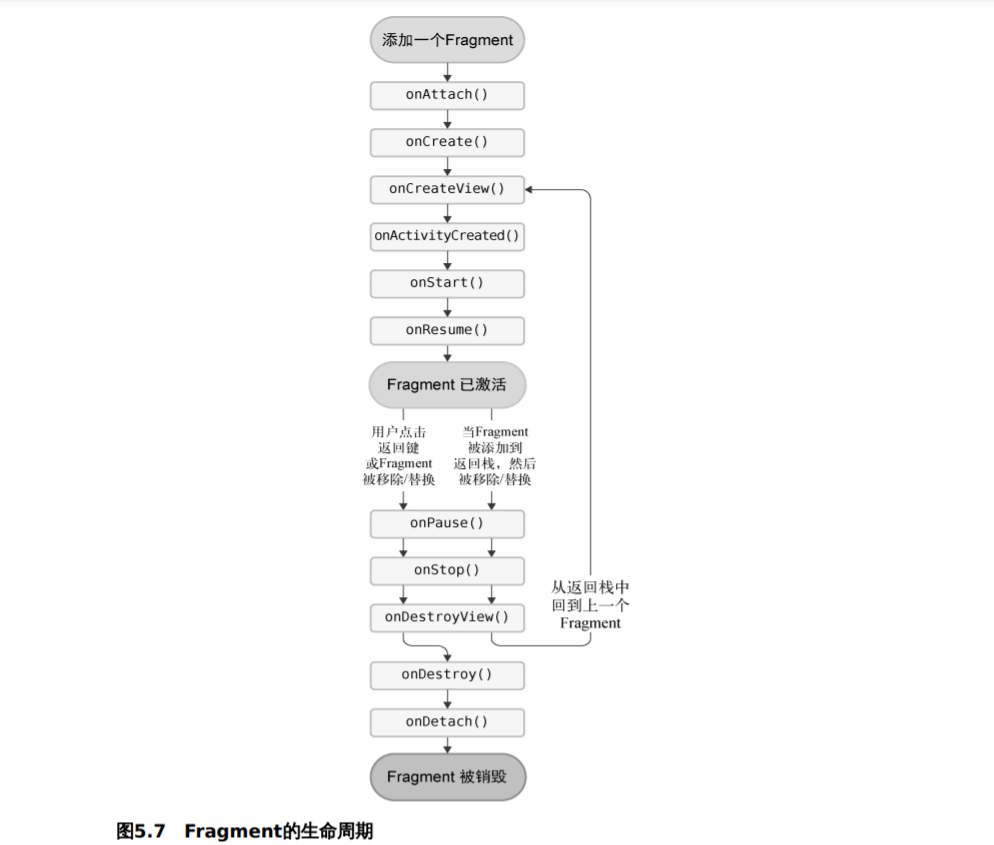

## Fragment

```java
public class Fragment implements ComponentCallbacks, View.OnCreateContextMenuListener, LifecycleOwner, ViewModelStoreOwner, HasDefaultViewModelProviderFactory, SavedStateRegistryOwner, ActivityResultCaller
```

[`Fragment`](https://developer.android.com/reference/androidx/fragment/app/Fragment?hl=zh-cn) 表示比view复杂, 比activity更轻量级

Fragment 定义和管理自己的布局，具有自己的生命周期，并且可以处理自己的输入事件

Fragment 不能独立存在，而是必须由 Activity 或另一个 Fragment 作为宿主

当 Activity 处于 `STARTED` [生命周期状态](https://developer.android.com/guide/components/activities/activity-lifecycle)或更高的状态时，可以添加、替换或移除 Fragment

可以将记录保留在由 Activity 管理的返回堆栈中，从而允许撤消这些更改

### fragment的创建

#### 设置依赖

在project的build.gradle中添加google maven 存储库

在module的build.gradle中添加以下依赖项

```groovy
dependencies {
    def fragment_version = "1.3.6"
    // Java language implementation
    implementation "androidx.fragment:fragment:$fragment_version"
    // Kotlin
    implementation "androidx.fragment:fragment-ktx:$fragment_version"
}
```

#### 创建 fragment 类

要创建自定义布局的fragment，请将fragment的布局资源提供给基本构造函数

```java
class ExampleFragment extends Fragment {
    public ExampleFragment() {
        super(R.layout.example_fragment);
    }
}
```

#### 把 fragment 添加到 activity

fragment必须嵌入到 AndroidX  FragmentActivity 才能提供ui显示,

> AppCompatActivity 是FragmentActivity的子类
>
> fragment可以放入AppCompatActivity

### 添加fragment

#### 通过 XML 添加

使用 `FragmentContainerView`元素

 android:name指定元素的fragment类

```xml

<!-- res/layout/example_activity.xml -->
<androidx.fragment.app.FragmentContainerView
    xmlns:android="http://schemas.android.com/apk/res/android"
    android:id="@+id/fragment_container_view"
    android:layout_width="match_parent"
    android:layout_height="match_parent"
    android:name="com.example.ExampleFragment" />
```

#### 通过代码动态添加

如果通过代码动态添加就不要在xml中设置android:name属性

```java
if(savedInstanceState == null){
    getSupportFragmentManager().beginTransaction()
        .setReorderingAllowed(true)
        .add(R.id.main_my_fragment_code,MyFragment.class,null)
        .commit();
}
```

#### 向fragment中传递参数


### Fragment的生命周期




### google提供的方便使用的fragment的子类

Fragment 库提供了方便使用的基于fragment的类：

- [`DialogFragment`](https://developer.android.com/reference/androidx/fragment/app/DialogFragment)

  显示浮动对话框。使用此类创建对话框是在[`Activity`](https://developer.android.com/reference/android/app/Activity)类中使用对话框辅助方法的一个很好的替代方法 ，因为片段会自动处理`Dialog`. 有关 更多详细信息，请参阅[显示对话框`DialogFragment`](https://developer.android.com/guide/fragments/dialogs)。

- [`PreferenceFragmentCompat`](https://developer.android.com/reference/androidx/preference/PreferenceFragmentCompat)

  将[`Preference`](https://developer.android.com/reference/androidx/preference/Preference)对象层次结构显示 为列表。您可以使用`PreferenceFragmentCompat`来 [创建设置屏幕](https://developer.android.com/guide/topics/ui/settings)为您的应用程序。


#### fragment管理器

[`FragmentManager`](https://developer.android.com/reference/androidx/fragment/app/FragmentManager?hl=zh-cn) 类负责对应用的 Fragment 执行一些操作，如添加、移除或替换它们，以及将它们添加到返回堆栈

##### 访问fragmentManager

1. 在 Activity 中访问

   每个 [`FragmentActivity`](https://developer.android.com/reference/androidx/fragment/app/FragmentActivity?hl=zh-cn) 及其子类（如 [`AppCompatActivity`](https://developer.android.com/reference/androidx/appcompat/app/AppCompatActivity?hl=zh-cn)）都可以通过 [`getSupportFragmentManager()`](https://developer.android.com/reference/androidx/fragment/app/FragmentActivity?hl=zh-cn#getSupportFragmentManager()) 方法访问 `FragmentManager`。

2. 在 Fragment 中访问

   Fragment 也能够托管一个或多个子 Fragment
   
   在 Fragment 内，通过 [`getChildFragmentManager()`](https://developer.android.com/reference/androidx/fragment/app/Fragment?hl=zh-cn#getChildFragmentManager()) 获取对管理 Fragment 子级的 `FragmentManager` 的引用
   
   如果您需要访问fragment的宿主 `FragmentManager`，可以使用 [`getParentFragmentManager()`](https://developer.android.com/reference/androidx/fragment/app/Fragment?hl=zh-cn#getParentFragmentManager())。

##### 使用 FragmentManager

 调用 [`FragmentManager.popBackStack()`](https://developer.android.com/reference/androidx/fragment/app/FragmentManager?hl=zh-cn#popBackStack()) 时，最上面的 Fragment 事务会从堆栈中弹出 

 对事务调用 [`addToBackStack()`](https://developer.android.com/reference/androidx/fragment/app/FragmentTransaction?hl=zh-cn#addToBackStack(java.lang.String)) 时，请注意，事务可以包括任意数量的操作，如添加多个 Fragment、替换多个容器中的 Fragment，等等。弹出返回堆栈时，所有这些操作会作为一项原子化操作反转 

##### 执行事务

 使用 `FragmentManager` 创建 `FragmentTransaction`

在事务transaction中，可以对容器执行 [`add()`](https://developer.android.com/reference/androidx/fragment/app/FragmentTransaction?hl=zh-cn#add(int, java.lang.Class, android.os.Bundle)) 或 [`replace()`](https://developer.android.com/reference/androidx/fragment/app/FragmentTransaction?hl=zh-cn#replace(int, java.lang.Class, android.os.Bundle)) 操作。 

```java
FragmentManager fragmentManager = getSupportFragmentManager();fragmentManager.beginTransaction()    .replace(R.id.fragment_container, ExampleFragment.class, null)    
    .setReorderingAllowed(true)    
    .addToBackStack("name") // name can be null    
    .commit();
```


#### 保存fragment的状态

由于fragment是由activity管理的, 每次activity变化时会影响到fragment, fragment经常重新创建


### ViewPager2

TODO : 使用过程中或报错

使用 ViewPager2 可以在fragment之间滑动

#### 添加AndroidX依赖项

```groovy
dependencies {
    implementation "androidx.viewpager2:viewpager2:1.0.0"
}
```

#### 创建fragemnt的布局xml文件

```xml
<?xml version="1.0" encoding="utf-8"?>
<androidx.constraintlayout.widget.ConstraintLayout xmlns:android="http://schemas.android.com/apk/res/android"
    android:layout_width="match_parent"
    android:layout_height="match_parent">
    <TextView
        android:id="@+id/fragment2_text_view"
        android:layout_width="match_parent"
        android:layout_height="match_parent"
        android:background="@drawable/view_pager_background_grey"
        android:text="text view"
        android:gravity="center"
        android:layout_marginRight="10dp"
        android:layout_marginLeft="10dp"
        />
</androidx.constraintlayout.widget
```

#### 创建fragment子类java文件

```java
public class MyFragmentForViewPager2 extends Fragment {
  public TextView textView;
  String tag;
  public MyFragmentForViewPager2(String tag) {
    super(R.layout.my_fragment_layout);
    this.tag = tag;
  }

  @Nullable
  @Override
  public View onCreateView(@NonNull LayoutInflater inflater, @Nullable ViewGroup container, @Nullable Bundle savedInstanceState) {
    View fragmentView = inflater.inflate(R.layout.my_fragment_for_view_pager2_layout, container, false);
    textView = fragmentView.findViewById(R.id.fragment2_text_view);
    textView.setText(tag);
    return fragmentView;
  }
}
```

#### 创建 FragmentStateAdapter 子类java文件

给ViewPager2使用

```java
public class MyViewPager2Adapter extends FragmentStateAdapter {
  List<Fragment> fragmentList = new ArrayList<>();

  public MyViewPager2Adapter(@NonNull FragmentActivity fragmentActivity) {
    super(fragmentActivity);
    for (int i = 0; i < 3; i++) {
      fragmentList.add(new MyFragmentForViewPager2(String.valueOf(i)));
    }
  }

  @NonNull
  @Override
  public Fragment createFragment(int position) {
    return fragmentList.get(position);
  }

  @Override
  public int getItemCount() {
    return fragmentList.size();
  }
}

```

#### 在activity_main.xml布局中添加ViewPager2布局文件

```xml
    <androidx.viewpager2.widget.ViewPager2
        android:id="@+id/main_view_pager2"
        android:layout_width="match_parent"
        android:layout_height="180dp"
        android:layout_marginTop="10dp"
        app:layout_constraintTop_toBottomOf="@+id/main_view_pager"

        />
```


#### 在Acitivty中设置ViewPager2的适配器

这里写在一个method中

```java
  private void initViewPager2(){
    MyViewPager2Adapter myViewPager2Adapter = new MyViewPager2Adapter(this);
    ViewPager2 viewPager2 = findViewById(R.id.main_view_pager2);
    viewPager2.setAdapter(myViewPager2Adapter);
  }
```

#### TabLayout和Viewpager2的配合


#### todo : 自定义ViewPager2切换fragment时的动画

等学了动画再回来细看