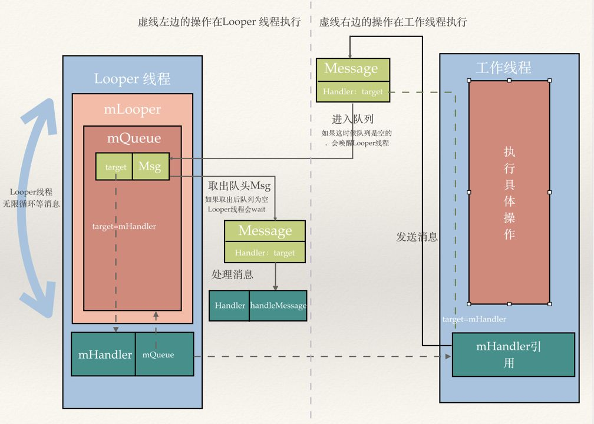

## handler原理

#### handler的使用



> 图片来自 : https://www.zhihu.com/question/19703357

thread1调用thread2的handler 发送消息给 MessageQueue

实际上是thread1调用 MessageQueue的enqueueMessage方法

thread2的looper就会注意到消息并处理

```java
// 一个Looper线程实现的典型例子
// 使用分离prepare()和loop()创建初始Handler与Looper进行通信 
class LooperThread extends Thread {
      public Handler mHandler;
      public void run() {
          Looper.prepare();
          mHandler = new Handler(Looper.myLooper()) {
              public void handleMessage(Message msg) {
                  // process incoming messages here
              }
          };
          Looper.loop();
      }
  }
```

#### Looper的停止

```java
handler.getLooper().quitSafely();
```

线程只能暂停别的线程的looper, 因为looper开启后是死循环

#### handler 消息机制


每个线程各自的 looper 从各自的 messageQueue 中取出 message

一个 handler 和一个 looper 绑定, 可以通过 handler 发送 message 给 looper 所属的线程, 并且handler 的`run()`负责处理发送给本线程的 message

ui 主线程自带一个 looper, 其余线程必须自己创建并启动 looper

Looper内部使用了threadLocal来记录不同线程对应的looper


#### MessageQueue

有两个重要方法

enqueueMessage()

其中使用synchronized同步, 将message放入队列, 根据情况判断是否唤醒队列

next()

无限循环方法

队列没有消息, 就阻塞

有就执行

message的延时执行在这里实现, 根据now和msg.when来判断是否执行, 时间没到就休眠指定时长


#### Message

实际上post(Runnable)内部也是通过sendMessageAtTime()，将一个runnable类放入message中再传进去


```java
Message msg = new Message(); 
// 下面的是复用池中的消息, 可以节省性能开销
Message msg = mHandler.obtainMessage();
Message m = Message.obtain();
```

#### Looper

通过Looper.prepare()可以为当前线程创建looper, 并初始化内部变量mQueue

在prepare()中向sThreadLocal放入looper

```java
// ...
 static final ThreadLocal<Looper> sThreadLocal = new ThreadLocal<Looper>();
// ...
private static void prepare(boolean quitAllowed) {
    if (sThreadLocal.get() != null) {
        throw new RuntimeException("Only one Looper may be created per thread");
    }
    sThreadLocal.set(new Looper(quitAllowed));
}
```

Looper.loop() 开启消息循环系统，在其中循环调用me.mQueue.next()


#### Handler

在构造时指定looper， 这样handler就获取到了looper的mQueue的引用，可以enqueueMessage()

#### 同步屏障

Message 有 3 种类型：普通(同步)消息(normal)，异步消息(async)，消息屏障(barrier)

屏障消息： message 的 target =null（也即handler 为 null，意味着该消息不需要分发）
异步消息： 将message 的 isAsynchronous() 设置为 true
同步消息：我们平时使用 sendMessage 发送的消息 都是同步消息，也即普通消息

> 原文链接：https://blog.csdn.net/hust_twj/article/details/99012524 

发送同步屏障后, 线程先执行异步消息, 直到关闭屏障后依次执行

在View更新时，draw、requestLayout、invalidate等很多地方都调用了同步屏障

### handler内存泄漏

1. looper引用了handler

   Handler 对象的 sendMessage() 或者 post()  最终会调用 Handler 的 enqueueMessage()

   在 enqueueMessage()中`msg.target=this;` 引用了handler

2. handler引用外部类

   

   如果handler初始化为**内部类**, 则Handler默认持有外部类的引用

引用路径 : looper -> messageQueue -> handler -> activity

#### 解决方式

- 将 Handler 独立出去，单独一个 java 文件
- 使用 静态内部类+弱引用 来实现 Handler
- Activity销毁，生命周期结束的时候清空MessageQueue内的所有Message


