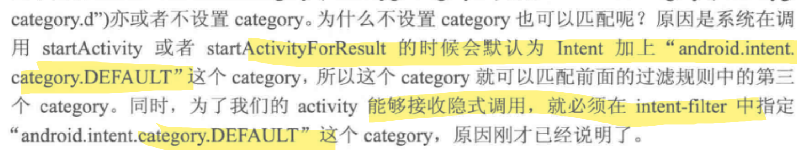
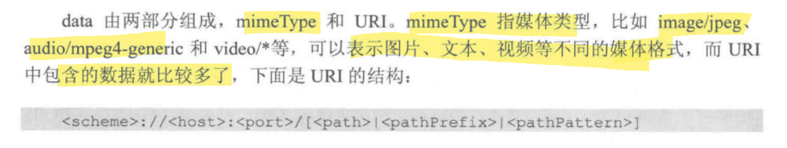

## todo : Intent

intent 中带有信息, 传递给被调用的组件

可以启动并传递信息给 activity, service, boardcastReceiver

### intent 类中字段

- Component name : 要启动的组件名称, 可以使用 `setComponent()`、`setClass()`、`setClassName()`，或 `Intent` 构造函数设置组件名称

- Action : 用于指定 intent 的操作行为, 只能指定一个

- Category : 指定 intent 的操作类别, 可以指定多个

- Data : 既 Uri , 和 action 配合使用 , 指定 action 要操作的数据**路径**

  

- Type : 用于指定 Data 类型的定义

- Extras : 拓展信息

- Flags : 指定intent的运行模式

#### 常用方法

setData()

setDataAndType()

putExtra() 

>  参数是一个string 加基本类型, 序列化对象, 他们的数组, bundle 

putExtras(bundle)

> **Bundle**主要用于传递数据
>
> 其数据，是以**key-value(键值对)**的形式存在的。
>
> 经常使用Bundle**在Activity之间传递数据**
>
> 传递的数据可以是boolean、byte、int、long、float、double、string等基本类型或它们对应的数组，也可以是对象或对象数组。
>
> 当Bundle传递的是对象或对象数组时，必须对象类实现Serializable 或Parcelable接口


### 显式 intent

 直接在构造函数中指定来源类和目标类

### 隐式 intent

不指定目标类, 根据动作让系统匹配拥有相同字符串定义的目标

将 Intent 的内容与在设备上其他应用的[清单文件](https://developer.android.google.cn/guide/topics/manifest/manifest-intro)中声明的`intent-filter`的action, category, data进行比较, 三个信息需要全部匹配

如果匹配，则系统将启动该组件，并向其传递 `Intent` 对象

如果多个 Intent 过滤器兼容，则系统会显示一个对话框，支持用户选取要使用的应用。

#### Intent Filter 意图过滤器

 intent-filter 是在manifest中定义的 , 用于指定该组件要接收的 Intent 类型

例如 : AndroidManifest.xml 里activity 节点中就包含了 intent-filter

> 启动 `Service` 时，请始终使用显式 Intent
>
> 从 Android 5.0（API 级别 21）开始，如果使用隐式 Intent 调用 `bindService()`，系统会抛出异常

#### 匹配规则

##### action的规则

intent必须有一个action并且filter的action的其中之一的字符串值必须一样

##### category 规则

如果intent有category, 其所有的category必须和filter中的category匹配, 既是其子集

如果intent未设置category, 系统默认为其加上



##### data 规则




data更多字段解析见<<android开发艺术探索>> P31

intent必须有data数据并且匹配filter的某一个data部分

如果要设置data和type,必须使用 setDataAndType, 而不是分别使用setData和setType

#### 强制使用用户选择器

如果多个应用可以响应 Intent, 用户可以选择要使用的应用并设为默认

如果不想用默认, 可以强制显示选择器对话框

使用 `createChooser()` 创建 `Intent`，并将其传递给 `startActivity()`, 选择器对话框必定显示

```java
Intent sendIntent = new Intent(Intent.ACTION_SEND);
...

// Always use string resources for UI text.
// This says something like "Share this photo with"
String title = getResources().getString(R.string.chooser_title);
// Create intent to show the chooser dialog
Intent chooser = Intent.createChooser(sendIntent, title);
```

#### 防止intent没有被处理

```java
// Verify the original intent will resolve to at least one activity
if (sendIntent.resolveActivity(getPackageManager()) != null) {
    startActivity(chooser);
}
```


### pendingIntent

public final class PendingIntent extends Object implements Parcelable

PendingIntent 对象是 Intent 对象的包装器

PendingIntent 的主要目的是授权外部应用使用其中包含的 Intent

PendingIntent 是 Android 提供的一种用于外部程序调起自身程序的能力，生命周期不与主程序相关。

外部程序通过 PendingIntent 只能调用起三种组件：

- Activity
- Service
- BroadcastReceiver

