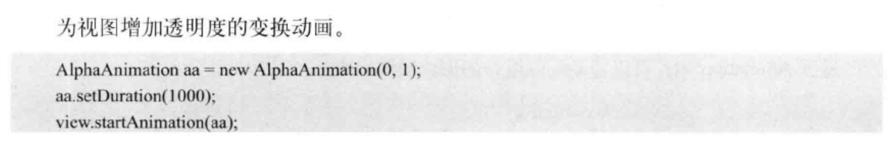

## 动画

各动画的作用对象

- drawable动画(frame animation) : drawable
- view动画 : view
- 属性动画 : view
- 基于物理的动画 : 
- transition : 布局改变或activity过渡

> 帧动画和补间动画似乎已经过时, 谷歌的guide只找到了属性动画

### 动画简介

动画作用对象:

- 位图
- 界面可见性和动作
- 布局更改
- acitvity切换

### 属性动画

> 相关类在android.animation包中

属性动画实际修改的是对象本身

> 修改view的left, 那left就改变了, 而不只是视觉上的改变

#### 动画原理

`ValueAnimator` 包含 `TimeInterpolator` 和 `TypeEvaluator`

- ValueAnimator 计算已完成动画分数

  > 已完成动画分数表示动画已完成时间的百分比

- TimeInterpolator 根据已完成动画分数和时间插值计算插值分数

  > 在 `ValueAnimator` 计算完已完成动画分数后，它会调用当前设置的 `TimeInterpolator` 来计算插值分数。插值分数会将已完成动画分数映射为一个新分数，该分数会考虑已设置的时间插值

- TypeEvaluator 计算要添加的动画效果的属性的值

  > 计算插值分数后，`ValueAnimator` 会调用相应的 `TypeEvaluator`，以根据动画的插值分数、起始值和结束值来计算要添加动画效果的属性的值

假设整个动画要40ms, 当前已完成动画分数为 25%, 插值分数为10%, 带动画效果的属性的值当前为`(起始值-结束值)*插值分数`

#### api概览

可以在 `android.animation` 中找到属性动画系统的大多数 API

里面定义了许多 Animator子类, TypeEvaluator 和 TimeInterpolator 实现类 

Animator 类提供了创建动画的基本结构, 通常使用子类

> 通常不会直接使用此类，因为它只提供极少的功能，这些功能必须经过扩展才能全面支持为值添加动画效果

#### View 的 animate()

属性动画的方便写法

- 
- 

常用方法

> 可以连写setXXX()方法来同时改变属性
>
> ```java
> view.animate()
>         .scaleX(1)
>         .scaleY(1)
>         .alpha(1);
> ```

- translationX和translationY : 用来沿着X轴或者Y轴进行平移

- rotation、rotationX、rotationY : 用来围绕View的支点进行

- PrivotX和PrivotY : 控制View对象的支点位置，围绕这个支点进行旋转和缩放变换处理。默认该支点 位置就是View对象的中心

- alpha : 透明度，默认是1(不透明)，0代表完全透明

- x和y : 描述View对象在其容器中的最终位置

  

#### ObjectAnimator

是ValueAnimator的子类-

- ObjectAnimator通过工厂方法实例化

  - 
  - 参数
    - Object : 一个对象
    - String : 对象的属性名
    - float... : float 数组,属性变化的取值过程
  - 类中方法
    - ofFloat, ofInt, ofObject... , 可以通过参数指定要用的TypeEvaluator
    - setDuration(int duration) 设置动画时长
    - setInterpolator(Interpolator interpolator) 设置 Interpolator, 用来设置不同的插值器
    -  `ofPropertyValuesHolder()`
- 在使用ObjectAnimator的时候，要操作的属性必须要有get和set方法，不然 ObjectAnimator 就无法生效

  - 如果一个属性没有get、set方法，也可以通过自定义一个属性类或包装类来间 接地给这个属性增加get和set方法。现在来看看如何通过包装类的方法给一个属性增加get和set方法，代码如 下所示:
  - 
  


##### 代码示例

```java
public class CustomView extends View {
	
	// 自定义了一个实例属性progressPercent
    // 这里注意, 需要在属性的setter方法中invalidate()
    
    // ... 省略部分代码...
    
	String TAG= "kevin";
  	private int progressPercent = 0;
	public int getProgressPercent() {
    	return progressPercent;
	 }

    public void setProgressPercent(int progresPercent) {
        this.progressPercent = progresPercent;
        invalidate();

    }
    Paint paint = new Paint();
    @Override
    protected void onDraw(Canvas canvas) {
        super.onDraw(canvas);
        paint.setColor(0xff3333dd);
        paint.setTextSize(50);
        canvas.drawText(String.valueOf(progressPercent),100,100,paint);
    }
}
```

```java
	CustomView customView = findViewById(R.id.view_below);
    customView.setOnClickListener(new View.OnClickListener() {
      @Override
      public void onClick(View v) {
         // new ObjectAnimator, 然后start()
        ObjectAnimator animator = ObjectAnimator.ofInt(customView, "progressPercent", 0,100);
        animator.setDuration(10*1000).start();
      }
    });
```


#### ValueAnimator

ValueAnimator 只是通过渐变的方式来改变一个独立的数据, 用于第三方库没有提供属性的get和set方法, 

- ValueAnimator不提供任何动画效果，它更像一个数值发生器，用来产生有一定规律的数字，从而让调用者控制动画的实现过程。
- 通常情况下，在ValueAnimator的AnimatorUpdateListener中监听数值的变化，然后使用这个值改变 view 的属性
- 

#### TypeEvaluator子类

动画需要根据计算出的属性的值来变化

TypeEvaluator可以用来指示属性的值要怎么样变化

Android 系统可以识别的类型为 `int`、`float` 或颜色，对应的处理类 `IntEvaluator`、`FloatEvaluator` 和 `ArgbEvaluator` 

自定义一个TypeEvaluator实现类示例

```java
private class PointFEvaluator implements TypeEvaluator<PointF> {
   PointF newPoint = new PointF();

   @Override
   public PointF evaluate(float fraction, PointF startValue, PointF endValue) {
       float x = startValue.x + (fraction * (endValue.x - startValue.x));
       float y = startValue.y + (fraction * (endValue.y - startValue.y));

       newPoint.set(x, y);

       return newPoint;
   }
}
```


#### 动画事件的监听

- 完整的动画具有start、Repeat、End、Cancel这4个过程
- 
- 

#### PropertyValuesHolder 组合动画

如果有多个属性需要修改，可以把它们放在不同的 `PropertyValuesHolder` 中

使用 `ofPropertyValuesHolder()` 统一放进 `Animator`

此做法不用为每个属性单独创建一个 `Animator` 去执行


#### AnimatorSet 动画集合

多个动画配合工作, 控制它们的先后次序


- set.play()返回一个 Builder 对象

- Builder 类采用了建造者模式，每次调用方法时都返回 Builder 自身用于继续构建

- AnimatorSet.Builder中包括以下4个方法。AnimatorSet正是通过这几种方法来控制动画播放顺序的。

  -  after(Animator anim):将现有动画插入到传入的动画之后执行
  -  after(long delay):将现有动画延迟指定毫秒后执行。
  -  before(Animator anim):将现有动画插入到传入的动画之前
  -  with(Animator anim):将现有动画和传入的动画同时执行。

  

#### 指定keyframe关键帧

在 `PropertyValuesHolder` 的基础上，通过设置 `Keyframe` （关键帧)

把同一个动画属性拆分成多个阶段

例如，可以让一个进度增加到 100% 后再到80%

```java
// 在 0% 处开始
Keyframe keyframe1 = Keyframe.ofFloat(0, 0);
// 时间经过 50% 的时候，动画完成度 100%
Keyframe keyframe2 = Keyframe.ofFloat(0.5f, 100);
// 时间见过 100% 的时候，动画完成度倒退到 80%，即反弹 20%
Keyframe keyframe3 = Keyframe.ofFloat(1, 80);
PropertyValuesHolder holder = PropertyValuesHolder.ofKeyframe("progress", keyframe1, keyframe2, keyframe3);

ObjectAnimator animator = ObjectAnimator.ofPropertyValuesHolder(view, holder);
animator.start();
```


#### 在XML中使用属性动画

属性动画的方便写法


### drawable动画 

又称 帧动画 Frame Animation

使用一组连续的图片,每张图片播放一定的时间,组合起来变成动画

- xml 方式实现


- java 实现

  

  

## 

### view动画

> 又称补间动画 Tween Animation

主要是指 `android.view.animation` 包中的类

只能被用来设置给 View

控件的位置不会跟随动画移动

能够实现的效果只有移动、缩放、旋转和淡入淡出操作四种及其组合。

> << Android 高级进阶 >> 有详细的 API 使用指南
>
> xml 和 java 中都可以使用

指定开始和结束,Android 自动生成中间帧

- 插值器 Interpolator (接口)
  - 控制动画的变化速度
  - Android 有实现好的类
  - 
  - 动画使用插值器 : `animation.setInterpolator(new AccelerateInterpolator());`

- AlphaAnimation 透明度动画
  - 
- RotateAnimation 旋转动画
  - 
- TranslateAnimation 位移动画
  - 
- ScaleAnimation 缩放动画
  - 
- AnimationSet 动画集合
  - 
- View 动画的监听
  - 

### Transition布局动画

自动添加动画

在xml布局文件中设置指定view的属性

```xml
<LinearLayout android:id="@+id/container"
              android:animateLayoutChanges="true"/>
```

为布局添加、移除或更新项目，系统就会自动对这些项目进行动画处理：
