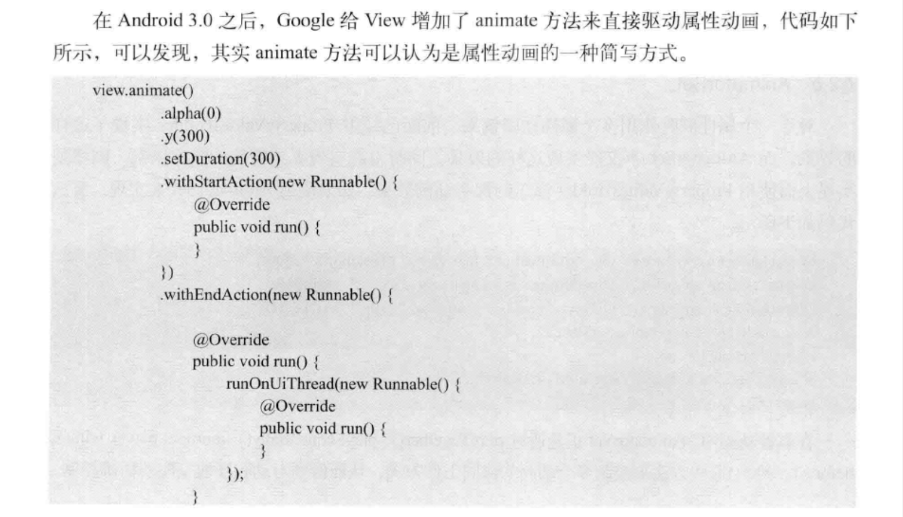

## 动画

> 各动画的作用对象
>
> 帧动画 : 图片
>
> 补间动画 : view
>
> 属性动画 : view

帧动画和补间动画似乎已经过时, 谷歌的guide只找到了属性动画

### 动画简介

动画作用对象:

- 位图
- 界面可见性和动作
- 布局更改
- acitvity切换

### 属性动画

属性动画实际修改的是对象本身

> 修改view的left, 那left就改变了, 而不只是视觉上的改变

#### 动画原理

`ValueAnimator` 包含 `TimeInterpolator` 和 `TypeEvaluator`

- ValueAnimator 计算已完成动画分数

  > 已完成动画分数表示动画已完成时间的百分比

- TimeInterpolator 根据已完成动画分数和时间插值计算插值分数

  > 在 `ValueAnimator` 计算完已完成动画分数后，它会调用当前设置的 `TimeInterpolator` 来计算插值分数。插值分数会将已完成动画分数映射为一个新分数，该分数会考虑已设置的时间插值

- TypeEvaluator 计算要添加的动画效果的属性的值

  > 计算插值分数后，`ValueAnimator` 会调用相应的 `TypeEvaluator`，以根据动画的插值分数、起始值和结束值来计算要添加动画效果的属性的值

假设整个动画要40ms, 当前已完成动画分数为 25%, 插值分数为10%, 带动画效果的属性的值当前为`(起始值-结束值)*插值分数`

#### api概览

>  可以在 `android.animation` 中找到属性动画系统的大多数 API
>
> 里面定义了许多 Animator子类, TypeEvaluator 和 TimeInterpolator 实现类 

Animator 类提供了创建动画的基本结构, 通常使用子类

> 通常不会直接使用此类，因为它只提供极少的功能，这些功能必须经过扩展才能全面支持为值添加动画效果

##### ObjectAnimator

是ValueAnimator的子类-

- 一个基本的平移动画

  - 
  - 参数
    - Object : 一个对象
    - String : 对象的属性名
    - float... : float 数组,属性变化的取值过程

- 属性动画常用属性值

  - translationX和translationY : 用来沿着X轴或者Y轴进行平移
  - rotation、rotationX、rotationY : 用来围绕View的支点进行
  - PrivotX和PrivotY : 控制View对象的支点位置，围绕这个支点进行旋转和缩放变换处理。默认该支点 位置就是View对象的中心
  - alpha : 透明度，默认是1(不透明)，0代表完全透明
  - x和y : 描述View对象在其容器中的最终位置

- 在使用ObjectAnimator的时候，要操作的属性必须要有get和set方法，不然 ObjectAnimator 就无法生效

  - 如果一个属性没有get、set方法，也可以通过自定义一个属性类或包装类来间 接地给这个属性增加get和set方法。现在来看看如何通过包装类的方法给一个属性增加get和set方法，代码如 下所示:

  - 

    

##### ValueAnimator

- ValueAnimator不提供任何动画效果，它更像一个数值发生器，用来产生有一定规律的数字，从而让调用者控制动画的实现过程。通常情况下，在ValueAnimator的AnimatorUpdateListener中监听数值的变化，然后使用这个值改变 view 的属性
- 

##### 动画事件的监听

- 完整的动画具有start、Repeat、End、Cancel这4个过程
- 
- 

##### AnimatorSet 动画集合

- 

- set.play()返回一个 Builder 对象

- Builder 类采用了建造者模式，每次调用方法时都返回 Builder 自身用于继续构建

- AnimatorSet.Builder中包括以下4个方法。AnimatorSet正是通过这几种方法来控制动画播放顺序的。

  -  after(Animator anim):将现有动画插入到传入的动画之后执行
  -  after(long delay):将现有动画延迟指定毫秒后执行。
  -  before(Animator anim):将现有动画插入到传入的动画之前
  -  with(Animator anim):将现有动画和传入的动画同时执行。

  

##### PropertyValuesHolder 组合动画

- 

#### 在XML中使用属性动画

属性动画的方便写法

- 

#### View 的 animate 方法

属性动画的方便写法

- 
- 

### 帧动画 Frame Animation

使用一组连续的图片,每张图片播放一定的时间,组合起来变成动画

- xml 方式实现

- java 实现

  

  

## 

### 补间动画 Tween Animation

> << Android 高级进阶 >> 有详细的 API 使用指南
>
> xml 和 java 中都可以使用

指定开始和结束,Android 自动生成中间帧

太简单,不可以做复杂的变换,而且真实位置没有改变

- 插值器 Interpolator (接口)
  - 控制动画的变化速度
  - Android 有实现好的类
  - 
  - 动画使用插值器 : `animation.setInterpolator(new AccelerateInterpolator());`

- AlphaAnimation 透明度动画
  - 
- RotateAnimation 旋转动画
  - 
- TranslateAnimation 位移动画
  - 
- ScaleAnimation 缩放动画
  - 
- AnimationSet 动画集合
  - 
- View 动画的监听
  - 

### 
