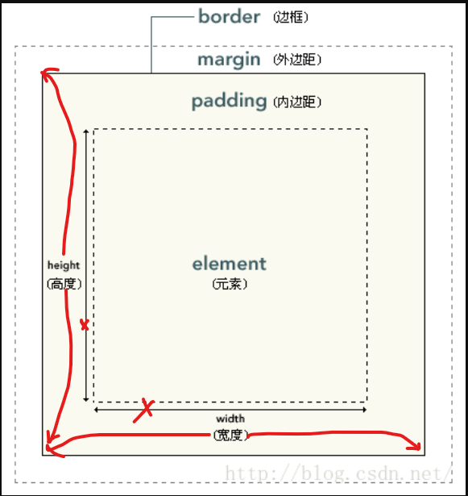

## 常用 ui 控件 (View 子类)

### 基础知识

android的view的部分属性关系



html的才是原图, android是图中修改过的


### TextView

### button

java 代码中使用`button.setOnClickListener(new MyOnClickListener)`

传入一个实现了 `View.OnLongClickListener` 接口的类, 在该类实现的接口方法中编写按下的代码


### EidtText

使用代码示例

```java
// 设置软键盘的ime
urlEditText.setImeOptions(EditorInfo.IME_ACTION_DONE);
// 设置单行, 软键盘就会显示ime而不是换行符
urlEditText.setSingleLine();
// 设置动作监听器
urlEditText.setOnEditorActionListener(new TextView.OnEditorActionListener() {
    @Override
    public boolean onEditorAction(TextView v, int actionId, KeyEvent event) {
        if(actionId==EditorInfo.IME_ACTION_DONE){
            webView.loadUrl("https://"+String.valueOf(v.getText()));
            return true;
        }
        return false;
    }
});
```


### ImageView

只能显示图像

### ProgressBar

### Notification

### ToolBar

## 常用布局 layout

### relativeLayout 相对布局

view依靠父view和同级view之间的相对位置来布局

```xml
<RelativeLayout
    android:layout_width="match_parent"
    android:layout_height="match_parent">
    <Button
        android:id="@+id/button_main"
        android:layout_width="wrap_content"
        android:layout_height="wrap_content"
        
        android:layout_centerInParent="true"
        />

</RelativeLayout>
```


### linearLayout线性布局

常用属性

```
	// 布局方向
    android:orientation="vertical"
    // 布局宽度
    android:layout_width="match_parent"
    // 布局高度
    android:layout_height="match_parent"
	// 内部试图重力
	android:gravity="center"
```


### frameLayout

新添加的 view 会覆盖在之前的 view 上面

设置FrameLayout的前景图像可以使其固定在最上面

```xml
<FrameLayout
    android:layout_width="match_parent"
    android:layout_height="200dp"
    android:foregroundGravity="center"
    android:foreground=""
    >
    <Button
        android:layout_width="wrap_content"
        android:layout_height="wrap_content"
        />
</FrameLayout>
```


### tableLayout

### gridLayout

### constraintLayout


## 高级控件

### ListView 

#### 继承抽象类 BaseAdapter

难理解的是

`@Override  public View getView(int position, View convertView, ViewGroup）` 

- positon：代表在列表中的位置
- convertView：代表被给的 view
  - 如果这个为 null ，代表 ListView 里面没有回收的子视图，那就用这个创建一个子视图，赋值数据然后返回
  - 如果不为 null，代表ListView 里面有回收的子视图，赋值数据后返回

> 
>
> 
>
> 子视图第一次在 getView 中被创建的时候，给它写个标签，

```java
public class BatteryListAdapter extends BaseAdapter {

  Context context;
	ArrayList<MainActivity.BatteryChangedTimeInformation> list;

  public BatteryListAdapter(Context context, 			  	ArrayList<MainActivity.BatteryChangedTimeInformation> list){
    this.context = context;
    this.list = list;
  }

  @Override
  public int getCount() {
    return list.size();
  }

  @Override
  public Object getItem(int position) {
    return list.get(position);
  }

  @Override
  public long getItemId(int position) {
    return position;
  }

  @Override
  public View getView(int position, View convertView, ViewGroup parent) {
    ViewHolder viewHolder;
//ListView 使用 getView 来获取子视图，这个时候 convertView 为 null
    if(convertView == null){
      // 创建一个新的视图持有者
      viewHolder = new ViewHolder();
      // 创建一个子视图
      convertView = LayoutInflater.from(context).inflate(R.layout.adapter_child_view_layout, null);
      // 视图持有者获取视图
      viewHolder.textView = convertView.findViewById(R.id.textView);
      // 给子视图打上标签
      convertView.setTag(viewHolder);
    }
    // ListView 会回收不在屏幕中显示的子视图，converView 为回收的子视图
    else {
    // 此时就可以获取第一次创建视图时打的标签
      viewHolder = (ViewHolder)convertView.getTag();
    }

    // 利用视图持有者修改数据（其实子视图只有一个 TextView 的话，直接强制转换为 TextView，应该也是可以的，就可以不用 viewHolder 了）
    viewHolder.textViewString = list.get(position).currentTimeStr+"  "+list.get(position).batteryRemained+"%";
    viewHolder.textView.setText(viewHolder.textViewString);


    return convertView;
  }

  private class ViewHolder{
    TextView textView;
    String textViewString;
  }
}
```

 

#### 实现 ListView 代码

```java
ListView listView = findViewById(R.id.listview);
ArrayList<BatteryChangedTimeInformation> batteryList = new ArrayList<>();
// ......
// 为 batteryList 添加内容
// ......
ArrayAdapter<BatteryChangedTimeInformation> adapter = new ArrayAdapter<>(this,R.layout.adapter_child_view_layout, batteryList);
listView.setAdapter(adapter);
```

### RecyclerView

### dialog对话框

`Dialog` 类是对话框的基类，但您应避免直接实例化 `Dialog`，而是应使用下列子类之一：

- `AlertDialog`

  此对话框可显示标题、按钮（最多三个）、选项列表或自定义布局。

- `DatePickerDialog` 或 `TimePickerDialog`

  此对话框带有允许用户选择日期或时间的预定义界面。

应使用 `DialogFragment` 作为对话框的容器。`DialogFragment` 类提供创建对话框和管理其外观所需的所有控件，而非调用 `Dialog` 对象上的方法。

使用 `DialogFragment` 来管理对话框可确保对话框能正确处理各种生命周期事件，如用户按“返回”按钮或旋转屏幕时。此外，`DialogFragment` 类还允许您以可嵌入组件的形式在较大界面中重复使用对话框的界面，类似于传统的 `Fragment`（例如，当您想让对话框界面在大屏幕和小屏幕上具有不同外观时）。


### Fragment

[`Fragment`](https://developer.android.com/reference/androidx/fragment/app/Fragment?hl=zh-cn) 表示应用界面中可重复使用的一部分。Fragment 定义和管理自己的布局，具有自己的生命周期，并且可以处理自己的输入事件。Fragment 不能独立存在，而是必须由 Activity 或另一个 Fragment 托管

#### fragment的创建

##### 设置依赖

在project的build.gradle中添加google maven 存储库

在module的build.gradle中添加以下依赖项

```groovy
dependencies {
    def fragment_version = "1.3.6"
    // Java language implementation
    implementation "androidx.fragment:fragment:$fragment_version"
    // Kotlin
    implementation "androidx.fragment:fragment-ktx:$fragment_version"
}
```

##### 创建 fragment 类

要创建自定义布局的fragment，请将fragment的布局资源提供给基本构造函数

```java
class ExampleFragment extends Fragment {
    public ExampleFragment() {
        super(R.layout.example_fragment);
    }
}
```

##### 把 fragment 添加到 activity

fragment必须嵌入到 AndroidX  FragmentActivity 才能提供ui显示, 而AppCompatActivity 是FragmentActivity的子类, 可以放入AppCompatActivity

#### 添加fragment

##### 通过 XML 添加

要以声明方式将片段添加到活动布局的 XML，请使用 `FragmentContainerView`元素。

```xml
<!-- res/layout/example_activity.xml -->
<androidx.fragment.app.FragmentContainerView
    xmlns:android="http://schemas.android.com/apk/res/android"
    android:id="@+id/fragment_container_view"
    android:layout_width="match_parent"
    android:layout_height="match_parent"
    android:name="com.example.ExampleFragment" />
```

##### 通过代码动态添加

如果通过代码动态添加就不要在xml中设置android:name属性

```java
if(savedInstanceState == null){
getSupportFragmentManager().beginTransaction()
.setReorderingAllowed(true)
.add(R.id.main_my_fragment_code,MyFragment.class,null)
.commit();
}
```

#### google提供的方便使用的fragment的子类

Fragment 库提供了方便使用的基于fragment的类：

- [`DialogFragment`](https://developer.android.com/reference/androidx/fragment/app/DialogFragment)

  显示浮动对话框。使用此类创建对话框是在[`Activity`](https://developer.android.com/reference/android/app/Activity)类中使用对话框辅助方法的一个很好的替代方法 ，因为片段会自动处理`Dialog`. 有关 更多详细信息，请参阅[显示对话框`DialogFragment`](https://developer.android.com/guide/fragments/dialogs)。

- [`PreferenceFragmentCompat`](https://developer.android.com/reference/androidx/preference/PreferenceFragmentCompat)

  将[`Preference`](https://developer.android.com/reference/androidx/preference/Preference)对象层次结构显示 为列表。您可以使用`PreferenceFragmentCompat`来 [创建设置屏幕](https://developer.android.com/guide/topics/ui/settings)为您的应用程序。

#### fragment管理器

[`FragmentManager`](https://developer.android.com/reference/androidx/fragment/app/FragmentManager?hl=zh-cn) 类负责对应用的 Fragment 执行一些操作，如添加、移除或替换它们，以及将它们添加到返回堆栈

##### 访问fragmentManager

1. 在 Activity 中访问

   每个 [`FragmentActivity`](https://developer.android.com/reference/androidx/fragment/app/FragmentActivity?hl=zh-cn) 及其子类（如 [`AppCompatActivity`](https://developer.android.com/reference/androidx/appcompat/app/AppCompatActivity?hl=zh-cn)）都可以通过 [`getSupportFragmentManager()`](https://developer.android.com/reference/androidx/fragment/app/FragmentActivity?hl=zh-cn#getSupportFragmentManager()) 方法访问 `FragmentManager`。

2. 在 Fragment 中访问

   Fragment 也能够托管一个或多个子 Fragment。在 Fragment 内，您可以通过 [`getChildFragmentManager()`](https://developer.android.com/reference/androidx/fragment/app/Fragment?hl=zh-cn#getChildFragmentManager()) 获取对管理 Fragment 子级的 `FragmentManager` 的引用。如果您需要访问其宿主 `FragmentManager`，可以使用 [`getParentFragmentManager()`](https://developer.android.com/reference/androidx/fragment/app/Fragment?hl=zh-cn#getParentFragmentManager())。

#### 保存fragment的状态

由于fragment是由activity管理的, 每次activity变化时会影响到fragment, fragment经常重新创建


### ViewPager2

使用 ViewPager2 可以在fragment之间滑动

#### 添加AndroidX依赖项

```groovy
dependencies {
    implementation "androidx.viewpager2:viewpager2:1.0.0"
}
```

#### 创建fragemnt的布局xml文件

```xml
<?xml version="1.0" encoding="utf-8"?>
<androidx.constraintlayout.widget.ConstraintLayout xmlns:android="http://schemas.android.com/apk/res/android"
    android:layout_width="match_parent"
    android:layout_height="match_parent">
    <TextView
        android:id="@+id/fragment2_text_view"
        android:layout_width="match_parent"
        android:layout_height="match_parent"
        android:background="@drawable/view_pager_background_grey"
        android:text="text view"
        android:gravity="center"
        android:layout_marginRight="10dp"
        android:layout_marginLeft="10dp"
        />
</androidx.constraintlayout.widget
```

#### 创建fragment子类java文件

```java
public class MyFragmentForViewPager2 extends Fragment {
  public TextView textView;
  String tag;
  public MyFragmentForViewPager2(String tag) {
    super(R.layout.my_fragment_layout);
    this.tag = tag;
  }

  @Nullable
  @Override
  public View onCreateView(@NonNull LayoutInflater inflater, @Nullable ViewGroup container, @Nullable Bundle savedInstanceState) {
    View fragmentView = inflater.inflate(R.layout.my_fragment_for_view_pager2_layout, container, false);
    textView = fragmentView.findViewById(R.id.fragment2_text_view);
    textView.setText(tag);
    return fragmentView;
  }
}
```

#### 创建 FragmentStateAdapter 子类java文件

给ViewPager2使用

```java
public class MyViewPager2Adapter extends FragmentStateAdapter {
  List<Fragment> fragmentList = new ArrayList<>();

  public MyViewPager2Adapter(@NonNull FragmentActivity fragmentActivity) {
    super(fragmentActivity);
    for (int i = 0; i < 3; i++) {
      fragmentList.add(new MyFragmentForViewPager2(String.valueOf(i)));
    }
  }

  @NonNull
  @Override
  public Fragment createFragment(int position) {
    return fragmentList.get(position);
  }

  @Override
  public int getItemCount() {
    return fragmentList.size();
  }
}

```

#### 在activity_main.xml布局中添加ViewPager2布局文件

```xml
    <androidx.viewpager2.widget.ViewPager2
        android:id="@+id/main_view_pager2"
        android:layout_width="match_parent"
        android:layout_height="180dp"
        android:layout_marginTop="10dp"
        app:layout_constraintTop_toBottomOf="@+id/main_view_pager"

        />
```


#### 在Acitivty中设置ViewPager2的适配器

这里写在一个method中

```java
  private void initViewPager2(){
    MyViewPager2Adapter myViewPager2Adapter = new MyViewPager2Adapter(this);
    ViewPager2 viewPager2 = findViewById(R.id.main_view_pager2);
    viewPager2.setAdapter(myViewPager2Adapter);
  }
```

#### TabLayout和Viewpager2的配合


#### todo : 自定义ViewPager2切换fragment时的动画

等学了动画再回来细看


