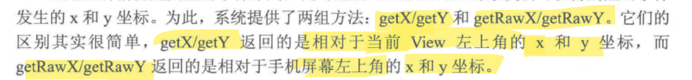

## Android 显示基础

### 屏幕显示

详情见 << Androidstudio 开发实战 从零基础到app上线>>

### View的 Size, padding and margins

height = contentHeight+padding

#### android 描述大小的单位

- px 像素
- dp 和设备无关的显示单位, aka dip
- sp 用于设置字体大小

在 xml 布局文件中, 除文字外都使用 dp 来保证不同尺寸的手机显示相同的大小

在 java 代码中, 只能使用 px , 为保证大小统一, 可以使用 `Utils.dip2px()` 把 dp 变成相应的 px

#### 颜色

##### 颜色的表示

- 八位十六进制数 : FFEEDDCC , 从前往后每两位代表一个值, 不透明度, 红色浓度, 绿色, 蓝色
- 六位十六进制数 : 在 xml 中默认 FF (不透明) , java 代码中默认 00 (全透明)

##### 使用

三种方法

> Color 中有定义好的 12 种颜色, 类型是 int

1. java代码中使用, 如 Color.red

2. 直接用十六进制的颜色编码赋值给 view

   - 在xml布局文件中设置颜色需要在色值前面加“#”，如`android:textColor="#000000"`

   - 在代码中设置颜色可以直接填八位的十六进制数值, 如`setTextColor(0xff00ff00)`;

   - 也可以通过`Color.rgb(int red, int green, int blue)`和`Color.argb(int alpha, int red, int green, int blue)`这两种方法指定颜色。

3. 在 colors.xml 中定义后使用
   - 如果要在布局文件中使用XML颜色常量，可引用“@color/常量名”
   - 如果要在代码中使用XML颜色常量，可通过这行代码获取：`getResources().getColor(R.color.常量名)`。

在java代码中一般**不要用**六位编码，因为六位编码在代码中默认透明

#### 屏幕分辨率

### 视图 View 类

View 是所有控件和布局的祖先

#### 位置参数

位置由顶点决定, top, left, right, botton

其坐标相对于view的父容器, 既父容器的左上角为(0, 0)

x, y是view在父容器的坐标

translationX和translationY是偏移量, 默认为0

x = left+translationX, y=top+translationY

### ViewGroup 类, 布局视图类

继承自view

本质上是容器, 在其中可以放置其他 view 

所有的布局视图类都是它派生来的

### 触摸基础

#### MotionEvent

手指触摸屏幕产生的一系列事件

此类的方法

⚠这里的getX获取的是**当前View内部**的x, 单位是像素

#### TouchSlop

系统可以识别的认为是滑动的最小距离

以下见<<android开发艺术探索>>

> VelocityTracker 追踪手指滑动速度
>
> GestureDetector 检测手势,
>
> Scroller 实现view的弹性滑动

### view的滑动

实现滑动的三种方式

#### 1 view的scrollby和scrollBy

scrollBy内部调用scrollTo , 其通过改变mScrollX/Y来产生滑动

mScrollX = view的left - 内容的Left

view的**布局位置没有改变**, 只改变了内容位置

#### 2 通过动画施加平移效果

改变view的tranlationX/Y属性

#### 3 改变view的layoutParams

