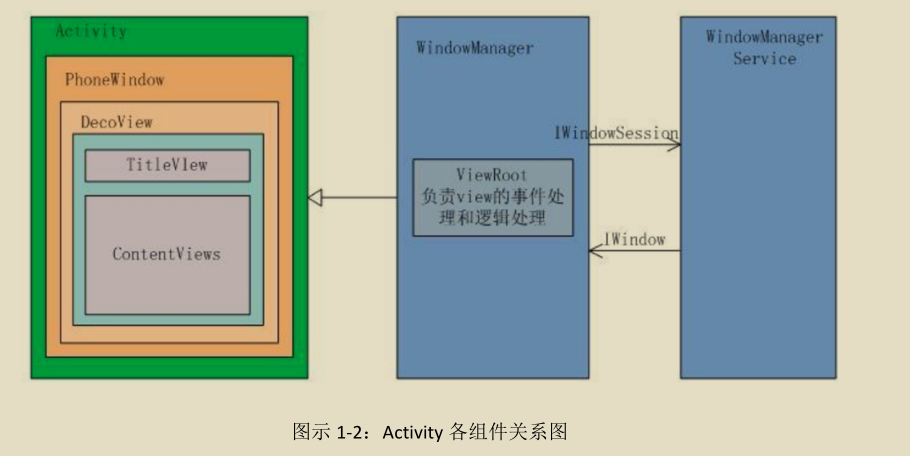

## 自定义View

### android 的UI系统层级

```
Acitvity
	PhoneWindow
		DecorView
			ActionBAr
			TitleView
			ContentView
```



### view的绘制流程

#### measure() : 计算view的尺寸

`measure()`中通过调用view的`onMeasure()`来计算view的尺寸

可以重写`onMeasure()`来自定义测量过程

##### 文本尺寸的测量

##### 图形尺寸测量

##### 布局尺寸测量

#### layout() : 用来确定view在父容器中的布局位置

#### draw()


### view 的工作原理

xml

customView class


### 坐标系

详情见 <<Android进阶之光>> 刘望舒

#### Android 坐标系


#### View 坐标系


在视图坐标系中,原点是父视图的左上角


- 绿色是 View 的方法
  - 还有 getHeight 和 getWidth 可以获取 view 自身的高度和宽度
- 蓝色是 MotionEvent 的方法,可以获取触摸的点的坐标


### Graphics2D api

只是简单写一下此api的概括, 具体见 <<Android 自定义组件开发详解 >>

#### point和pointF

点和用float保存的点

此类中有方法对点进行set, negate, offset 或者赋值给另一个点

#### Rect类和RectF

矩形和float的矩形

指定 top、left、right 和 bottom来确定一个矩形

此类中有方法: 

isEmpty(), width(), height(), centerX(), centerY(),exactCenterX(),set(), offset(), offsetTo(), contains() 以及矩形的交集与并集运算

Rect和RectF可以互相转换, 但是 float 和 int转换会有取舍问题


#### Bitmap类和BitmapDrawable

##### bitmap

> 位图，用于存储 png、jpg、gif 等格式的图片数据
>
> 很多时候如果需要在 Android 中对图片进行处理，需要先将图片读入 Bitmap 对象，接着调用相关的 API 对图片进行处理和加工

###### 读取

图片读取操作是由 BitmapFactory 类完成的, 可以从inputstream, byteArray, resource, file中读取, 生成bitmap

###### 创建

也可以创建bitmap对象

`Bitmap bmp = Bitmap.createBitmap(400, 400, Config. ARGB_8888);`

###### 修改

位于 res/drawable 目录下的图片读成 Bitmap 对象后是无法修改的，若要修改必须复制一张新的图片并设置可修改标记, 使用Bitmap 类的 copy()

```java
public Bitmap copy(Config config, boolean isMutable)
//参数 isMutable 为 true 表示复制的新位图可以修改。
```

###### 回收

Bitmap 是一种非常占用资源的对象, 要及时回收

```java
// 常见的回收 Bitmap 资源的代码形如（bmp 为 Bitmap 对象）：
if(bmp!= null && !bmp.isRecycled()){
    bmp.recycle();// 
    System.gc();//提醒 JVM 释放资源
    bmp = null;
}
// 同一个 Bitmap 对象不能连续回收多次
// 源码中发现 recycle()已经自己判断过了
// 所以可以不判空
```

###### 和bitmapDrawable的相互转换

BitmapDrawable 的构造方法 `public BitmapDrawable(Resources res, Bitmap bitmap)`用于将Bitmap转换成BitmapDrawable

而`bitmapDrawable.getBitmap()`方法则用于将 BitmapDrawable 转换成 Bitmap

###### 宽度和高度

Bitmap 和 BitmapDrawable 都能获得位图的宽度和高度

##### BimapDrawable

是 Android 的一种通用位图格式，我们可以简单粗暴地理解成 Bitmap 的另外一种表现形式

BimapDrawable 占用资源更少、性能更高 (和 Bitmap 相比 )

Bitmap 和 BitmapDrawable 可以相互转换

#### Canvas和Paint

- Canvas

  提供了若干方法用于绘制各
  种图形图案——点、线、圆等等。

- Paint

  Paint 类用于定义绘图时的参数，主要包含颜色、文本、图形样式、位图模式、滤镜等 (paint的reset()可以重置参数,不用每次都用新的paint)

paint和canvas联动

```java
canvas.drawText("韬睿科技，移动互联网卓越领导者!", 10, 100, paint);
canvas.drawRect(new Rect(10, 200, 350, 350), paint);
```

##### canvas的可以绘制的图形

- 位图

  在bitmap关联的canvas上画, 用imageview显示bitmap

- 点

  用 canvas的drawPoint()和drawPoints()绘制点

- 线

  用canvas的drawLine()和drawLines()绘制线

- 矩形 

  - 矩形 : drawRect()
  - 圆角矩形 : drawRoundRect()

- 圆, 包括椭圆, 扇形, 弧线

  椭圆的传入参数需要其外切矩形的上下左右

  - 圆 : drawCircle()
  - 椭圆 : drawOval()
  - 弧线 : drawArc()
  - 扇形 : drawArc()

- **路径 path**

  可以通过path绘制出多种形状的线条

  包括 矩形, 椭圆, 弧, 曲线, 贝塞尔曲线

  > Path 类支持二阶贝塞尔曲线和三阶贝塞尔曲线
  >
  > 贝塞尔曲线通过 3 个点来绘制一条平滑的曲线，这 3 个点分别是起点、控制点和终点
  >
  > 贝塞尔的曲线绘制有点复杂, 参阅<<android自定义组件开发详解>>

  多个path图形可以进行运算

  ```java
  Path path = new Path();
  canvas.drawPath(path, paint);
  ```

  

- 文字

  Canvas 为我们提供了两组方法，一组直接从指定的位置开始绘制文字，另一组沿着 Path 绘制文字：

### 使用 Graphics2D 实现 动态 效果

通常使用自定义的view子类

在 onDraw()中绘图, 当此 View 显示时会回调 onDraw()方法

View类的invalidate()用于重绘组件，不带参数表示重绘整个视图区域，带参数表示重绘指定的区域

> invalidate()方法只能在 UI 线程中调用，如果是在子线程中刷新组件，View 类还定义了另一组名为 postInvalidate 的方法：
>
> ​	public void postInvalidate()
>
> ​	public void postInvalidate(int left, int top, int right, int bottom)

#### 画布中的坐标转换

默认情况下，画布坐标的原点就是绘图区的左上角

> 向左为负，向右为正，向上为负，向下为正

对**坐标**进行转换的方式主要有 4 种：

- 平移 , 坐标原点移动
- 旋转 , 坐标系以原点或指定点为中心旋转指定度
- 缩放 , 以原点或指定点缩放坐标系, 既缩放坐标后指定点还在原来的位置
- 拉斜 , x轴和y轴旋转, 原来是直角坐标系, 拉斜后x和y轴的角度会改变

Canvas 定义了两个方法用于保存现场和恢复现场,用来恢复到坐标变化之前的状态：

- public int save() 保存坐标系到一个私有栈, 返回此坐标系的编号
-  public void restore() 将坐标系恢复到最近一次 save()执行之前的状态, 既弹出栈顶的坐标系, 传入编号可指定坐标系

Android 中定义了一个名为 Matrix 的类，该类定义了一个 3 * 3 的矩阵，关于矩阵涉及到《高等数学》方面的课程，我们不想过多讲解，只需知道通过 Matrix 同样可以实现坐标的变换

Matrix 的应用范围很广，Canvas、Shader 等都支持通过 Matrix 实现移位、旋转、缩放等效果

#### 剪切区（ Clip)

Canvas 提供了剪切区的功能

在cilp之前的绘制不受clip影响

剪切区可以是一个 Rect 或者是一个Path

> public boolean clipRect()
>
> 此函数有多个重载


两个剪切区还能进行图形运算，得到更加复杂的剪切区

与剪切区 Op 运算相关的方法如下：

> public boolean clipRect(RectF rect, Op op)
>
> 此函数有多个重载
>
> Op类是枚举类

### 双缓存技术

有两个绘图区，一个是 Bitmap 的 Canvas，另一个就是当前
View 的 Canvas

先将图形绘制在 Bitmap 上，然后再将 Bitmap 绘制在 View 上

```java
  // 获取bitmpa的canvas
  Canvas bitmapCanvas = new Canvas(bitmap);
```


#### 使用双缓存的意义

- 提高绘图性能

  先将内容绘制在 Bitmap 上，再统一将内容绘制在 View 上，可以提高绘图的性能

- 保存绘图历史

  将绘制的历史结果保存在一个 Bitmap 上

  当手指松开时，将最后的矩形绘制在 Bitmap 上

  同时再将 Bitmap 的内容整个绘制在 View 上

#### 绘制曲线

使用 canvas的path 和bitmap

path绘制的时候可以用贝塞尔曲线

> 使用下面的控制点的方法可以更加让贝塞尔曲线平滑
>
> 起点坐标为（x1，y1），终点坐标为（x2，y2），控制点坐标即为（（x1 + x2）/ 2，（y1 + y2）/ 2）

#### 绘制矩形

使用path和bitmap

