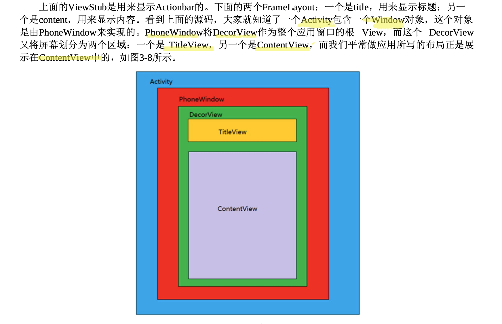

## 触摸和输入

### 输入事件

用户的输入有多种, 触摸输入, 硬件键盘输入, 手柄输入...

获取用户的触摸输入有两种方法

1. 重写view的`onTouchEvent()` 方法

   用户轻触一个 View 对象（例如，按钮）时，系统对该对象调用 `onTouchEvent()` 方法

2. 事件监听器

#### 事件监听器

事件监听器是 `View` 类中包含一个回调方法的接口。当用户与界面项目之间的互动触发已注册监听器的 View 对象时，Android 框架将调用这些方法

事件监听器接口中包含以下回调方法：

- `onClick()`

  在 `View.OnClickListener` 中。当用户轻触项目（在触摸模式下），或者使用导航键或轨迹球聚焦于项目，然后按适用的“Enter”键或按下轨迹球时，系统会调用此方法。

- `onLongClick()`

  在 `View.OnLongClickListener` 中。当用户轻触并按住项目（在触摸模式下）时，或者使用导航键或轨迹球聚焦于项目，然后按住适用的“Enter”键或按住轨迹球（持续一秒钟）时，系统会调用此方法。

- `onFocusChange()`

  在 `View.OnFocusChangeListener` 中。当用户使用导航键或轨迹球转到或离开项目时，系统会调用此方法。

- `onKey()`

  在 `View.OnKeyListener` 中。当用户聚焦于项目并按下或释放设备上的硬件按键时，系统会调用此方法。

- `onTouch()`

  在 `View.OnTouchListener` 中。当用户执行可视为触摸事件的操作时，包括按下、释放或屏幕上的任何移动手势（在项目边界内），系统会调用此方法。

- `onCreateContextMenu()`

  在 `View.OnCreateContextMenuListener` 中。当（因用户持续“长按”而）生成上下文菜单时，系统会调用此方法。请参阅[菜单](https://developer.android.com/guide/topics/ui/menus?hl=zh-cn#context-menu)开发者指南中有关上下文菜单的介绍。

代码实现

```java
// 可以传递一个的匿名类或button所在的activity
// 传入的类必须实现了OnClickListener接口
button.setOnClickListener(new View.OnClickListener() {
      @Override
      public void onClick(View v) {
        Toast.makeText(getApplicationContext(), "开启控制中心", Toast.LENGTH_SHORT).show();
        Log.d("kevin", "onClick: ");
      }
    });
```

一些其他事件监听器方法必须返回布尔值, 原因与后续涉及到的触摸事件的分发流程有关

> Android 会先调用事件处理程序，然后从类定义调用合适的默认处理程序
>
> 如果从这些事件监听器返回 true，系统会停止将事件传播到其他事件监听器，还会阻止回调 View 对象中的默认事件处理程序
>
> 在返回 true 时请确保您需要终止事件

#### TODO : 焦点与触摸模式

触摸模式与用户使用方向键和滚动轨迹球有关

焦点有些奇怪, 以后再学


#### 触摸事件 MotionEvent 的内容

触摸屏从被按下 touch down -> move -> touch up 到手指离开是一个触摸事件序列 ( 触摸事件序列 : MotionEvent )

#### 触摸事件的传递流程

事件传递顺序 : Activity -> Window ->z 轴最下层的View -> 依次向上传递



```java
boolean dispatchTouchEvent() // 事件被分发给视图时调用

boolean onInterceptTouchEvent() // 事件分发给视图后调用,视图拦截事件,返回 true 则拦截,不会分发给下一层

boolean onTouchEvent() // 事件被拦截后调用,在其中处理触摸事件的响应,返回结果代表是否
```


- 视图被分发触摸事件 , dispatchTouchEvent 被调用

- 判断是否拦截此次事件

  - 拦截就调用 onTouchEvent 处理触摸事件 ,
    - onTouchEvent 返回 true,此次事件被消耗 
    - onTouchEvent 返回 false,此次事件传递给父视图的 onTouchEvent
  - 不拦截就调用 child.dispatchTouchEvent 获取此函数的返回值

- dispatchTouchEvent 返回 onTouchEvent 或 child.dispatchTouchEvent 的结果

  

### 手势

可以方便检测用户的触摸输入


### View 的滑动

- layout() : View 的绘制方法,相当于重绘制
- offsetLeftAndRight() && offsetTopAndBottom()
- LayoutParams : 改变布局参数,设置 Margin
- 动画 : 属性动画可以改变 View 的位置
- scollTo 与 scollBy : 过程是瞬间完成的 , 移动的是View的内容 , 如果在ViewGroup中使用 , 则是移动其所有的子View,移动的参数应该为距离的负数,好像拿着手机拍摄报纸 , 报纸动 , 手机不动 , 想要下面的物体向上跑到中间 , 就要手机向下移动
- Scroller

